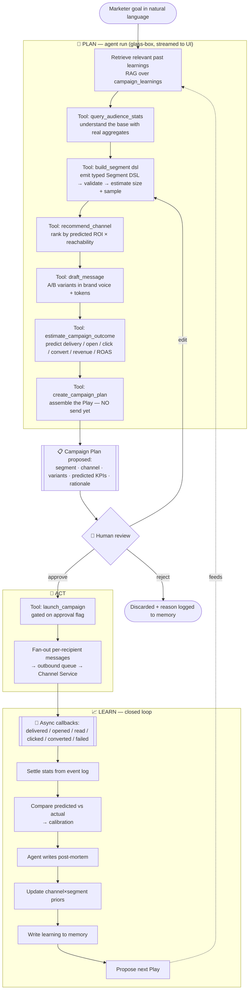
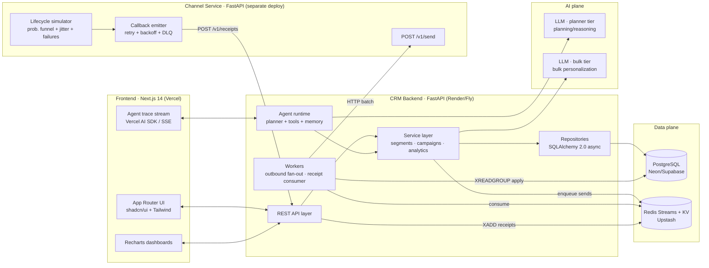
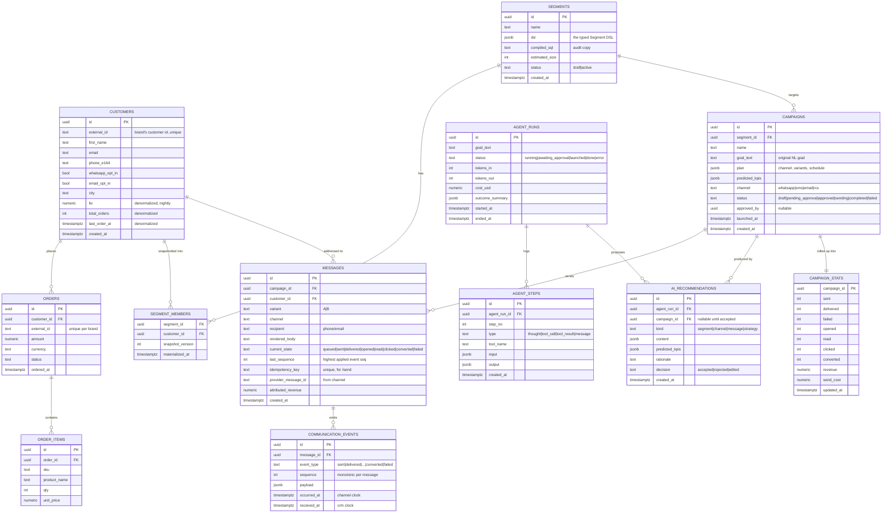
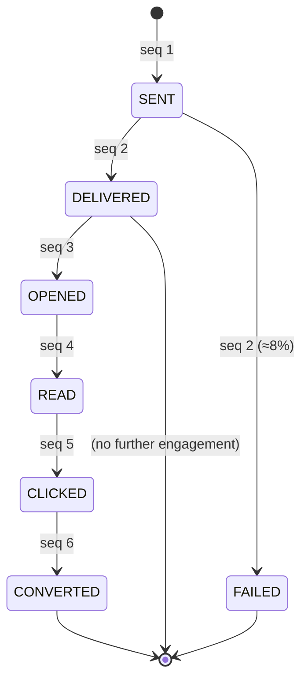
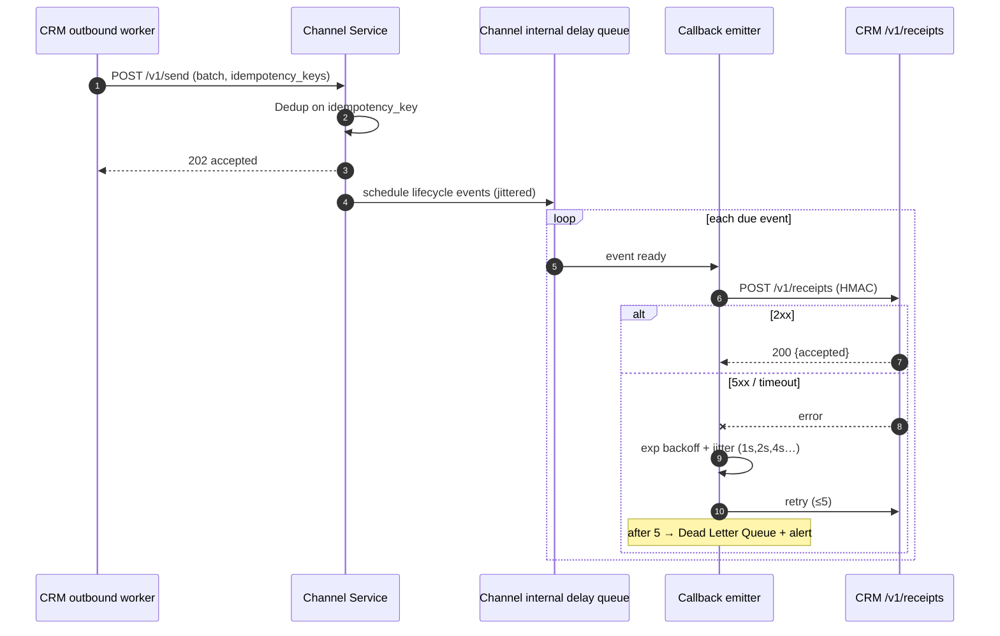
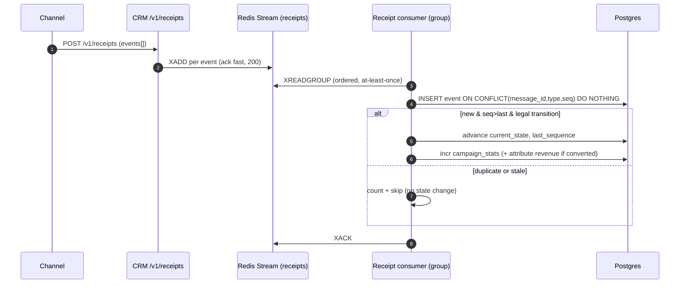
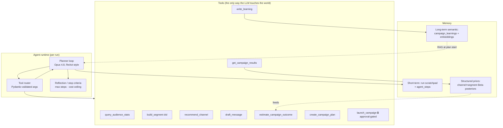
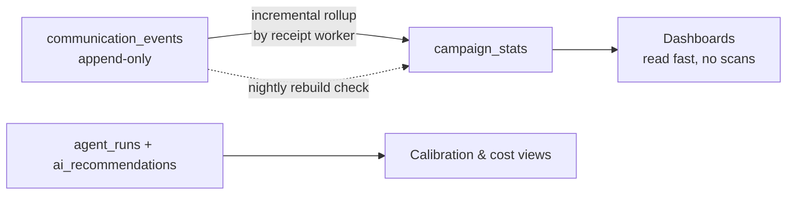
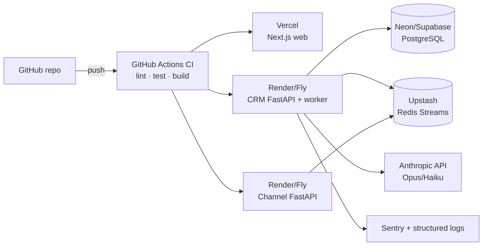

# Kairos — AI-Native Mini CRM

### Complete Build Blueprint · Xeno Engineering Take-Home (2026)

> **Thesis:** Most candidates will build "a CRM with a *Generate message* button." We build an **autonomous growth marketer** that runs a continuous **Plan → Act → Learn loop**, keeps a human in the approval seat, and *visibly gets smarter* every campaign. The closed learning loop mirrors the assignment's own channel-callback loop — that symmetry is the story.

**Stack at a glance:** Next.js + FastAPI (two services) + PostgreSQL + a frontier LLM (planner + bulk tiers) · all on free tiers.
**Build window:** June 9 → submit before 12 PM June 15, 2026 (5 working days + buffer).

---

## Table of Contents

1. [Executive Summary](#1-executive-summary)
2. [Product Recommendation](#2-product-recommendation)
3. [Product Vision](#3-product-vision)
4. [AI-Native Experience](#4-ai-native-experience)
5. [User Journey](#5-user-journey)
6. [Architecture](#6-architecture)
7. [Database Design](#7-database-design)
8. [APIs](#8-apis)
9. [Channel Service](#9-channel-service)
10. [Agent Design](#10-agent-design)
11. [Analytics](#11-analytics)
12. [Folder Structure](#12-folder-structure)
13. [Deployment](#13-deployment)
14. [Scalability](#14-scalability)
15. [Walkthrough Script](#15-walkthrough-script)
16. [Interview Questions](#16-interview-questions)
17. [Implementation Roadmap](#17-implementation-roadmap)
18. [Appendix A — AI-Native Dev Workflow](#18-appendix-a--ai-native-dev-workflow)
19. [Appendix B — The Cut List (what we deliberately did NOT build)](#19-appendix-b--the-cut-list)

---

## 1. Executive Summary

**Kairos** is an AI-native CRM for D2C / retail brands. A marketer states a goal in plain language —
*"Win back customers who haven't ordered in 60 days, maximise ROI"* — and Kairos's marketing agent:

1. **Analyses** the shopper base with real aggregate queries (not hallucinated numbers).
2. **Builds a segment** by emitting a typed, validated **Segment DSL** (never raw SQL).
3. **Recommends a channel** by predicted ROI *and* reachability (who actually has a WhatsApp opt-in / email).
4. **Drafts message variants** in the brand voice with personalization tokens.
5. **Predicts outcomes** — audience size, delivery, open/click/convert, revenue, ROAS — *before sending*.
6. **Proposes a complete "Play"** that the human **approves or edits** (a hard gate — no autonomous blasting).
7. **Executes** through a separate stubbed **Channel Service**, ingests the async event callbacks, and updates live stats.
8. **Learns** — compares predicted vs actual, writes a post-mortem to memory, updates its priors, and proposes the next experiment.

### Why this ranks in the top 5%

| Evaluation axis (from the brief) | How Kairos wins it |
|---|---|
| **Creativity in scoping** | One bold bet — *autonomous-but-supervised growth agent* — built deep, not ten features built shallow. Explicit cut list (Appendix B). |
| **AI-native development** | AI is the **control plane**, not a button. Plus a documented **AI-native dev workflow** (spec-first with an AI coding assistant, generated tests, AI self-review). |
| **Code quality & structure** | Clean layered FastAPI (api → service → repository → model); the LLM only ever emits **schema-validated DSL**, so AI output is auditable and testable. |
| **System design & scalability** | The channel loop is modeled seriously: idempotency keys, monotonic event sequencing, state-machine ordering, retries + DLQ, event-sourced stats. Explicit 10k → 100k → 1M plan. |
| **Communication clarity** | A 6-min video built around one unforgettable demo: type a goal → watch a **glass-box agent** reason → approve → watch events stream back → watch predictions calibrate. |

### The three things interviewers will remember

1. **The glass-box agent** — every reasoning step, tool call, and the *exact data it pulled* is visible in the UI.
2. **The Segment DSL compiler** — the LLM proposes a constrained JSON spec; a deterministic compiler turns it into parameterized SQL. Safe, auditable, testable AI.
3. **The calibration chart** — predicted vs actual KPIs converging over campaigns. Proof the system *learns*, not just *generates*.

---

## 2. Product Recommendation

### Phase 1 — Three competing concepts

#### Option A — Traditional CRM + AI Assistant
A classic dashboard (customers, segments, campaigns) where AI assists at steps: "suggest a segment," "draft this message."

- **Advantages:** Lowest risk; easy to demo; every feature is legible.
- **Disadvantages:** This is what *most* candidates build. AI is cosmetic ("bolted on" — the exact phrase the brief warns against). Low ceiling on "creativity in scoping."
- **Engineering effort:** Medium.
- **Differentiation:** ★★☆☆☆
- **Interview impact:** ★★☆☆☆ — competent, forgettable.

#### Option B — Chat-First CRM
Everything happens in a conversation. The marketer types; the product answers and acts.

- **Advantages:** Feels modern; natural language is a great demo; low UI surface area.
- **Disadvantages:** Hard to show segmentation depth and analytics in a chat transcript; risks looking like a thin GPT wrapper; "where's the system design?" is a fair interview attack. Conversation state is deceptively hard.
- **Engineering effort:** Medium–High.
- **Differentiation:** ★★★★☆
- **Interview impact:** ★★★☆☆ — exciting but fragile; easy to poke holes in reliability.

#### Option C — Autonomous Marketing Agent CRM  ✅ **(recommended, with a critical twist)**
A goal-driven agent plans, segments, picks the channel, drafts, predicts, executes, and learns — **with a human approval gate** and a **glass-box reasoning trace**.

- **Advantages:** Maximum "wow"; directly answers the brief's "true AI agent that takes a broad goal and executes." The approval gate + glass-box trace convert the usual *risk* of agents (unreliable, scary) into a *strength* (production maturity). The learning loop mirrors the channel callback loop — elegant.
- **Disadvantages:** Highest conceptual risk — *if built naively* it looks like a flaky demo. We neutralize this with: deterministic segment compilation, schema-validated tools, human approval before any send, and visible reasoning.
- **Engineering effort:** High — but tractable in 5 days because the "intelligence" sits on top of a clean, deterministic core.
- **Differentiation:** ★★★★★
- **Interview impact:** ★★★★★ — memorable *and* defensible.

### Recommendation

**Build Option C — but as "autonomous-but-supervised," not "fully autonomous."**

The winning insight: *interviewers fear an LLM that sends 50,000 messages unsupervised.* So we make the agent do all the **thinking** (analyze → segment → channel → draft → predict → assemble a plan) and make the human do the **committing** (approve / edit / launch). This is exactly how real growth teams operate, it's safer, it's a better demo (the human is part of the story), and it lets us show off both AI depth *and* engineering judgment.

> One-line pitch for the video: **"Kairos is a growth marketer that never sleeps — it brings you a fully-reasoned campaign with predicted ROI, you approve it, it runs it, and it learns from what happened."**

---

## 3. Product Vision

### Phase 2

| | |
|---|---|
| **Product name** | **Kairos** — Greek for *the opportune moment to act*. Good marketing is the right message to the right shopper at the right moment; that's literally what the product optimizes. (Alternates considered: *Tempo*, *Loop*, *Orbit*.) |
| **Mission** | Give every D2C brand an autonomous growth marketer that turns shopper data into well-reasoned, measurable campaigns — and gets smarter with every send. |
| **Target user** | The solo / small growth or CRM marketer at a D2C brand (fashion, coffee, beauty) who has rich shopper data but no time and no data team. |
| **Core workflow** | **Goal → Plan (agent) → Approve (human) → Execute (channel loop) → Learn (calibrate + memory) → next Play.** |
| **Key innovation** | A **closed-loop, glass-box agent** whose campaign predictions *visibly calibrate* over time, built on a deterministic, auditable Segment-DSL core. |

### Why it stands out among hundreds of submissions

- **It has a point of view.** The brief says "pick a point of view and commit." Kairos commits to: *the marketer's job is to set goals and approve; the machine's job is to reason and execute.*
- **The AI is load-bearing.** Remove the agent and there's no product. That's the definition of AI-native.
- **It closes the loop the assignment hands you.** They give you a callback-driven event loop; Kairos uses those very events to *learn*. Most candidates will treat events as "stats to display." We treat them as *training signal.*
- **It's honest about safety.** The approval gate says "I understand you don't let an LLM loose on your customers." That single decision reads as senior.

---

## 4. AI-Native Experience

### Phase 3 — the complete reasoning workflow

**Trigger:** the marketer types a goal (or picks a starter goal). Example: *"Bring back customers who haven't ordered in 60 days and maximize ROI."*



### What the AI is genuinely capable of (mapped to the brief's checklist)

| Capability | How it actually works (not hand-wavy) |
|---|---|
| **Understand marketing goals** | Opus 4.8 parses the goal into an intent object: objective (win-back / cross-sell / VIP / churn-save), constraints (budget, ROI target), KPI to maximize. |
| **Understand customer behaviour** | `query_audience_stats` runs *real* aggregate SQL (RFM distribution, days-since-order histogram, channel reachability). The model reasons over returned facts, never invents them. |
| **Build audience segments** | The model emits a **Segment DSL** (typed JSON). A deterministic compiler validates → compiles to parameterized SQL → returns estimated size + a sample. The LLM never writes SQL. |
| **Recommend campaigns** | RAG over past `campaign_learnings` ("win-back on WhatsApp beat SMS 2.3× for high-LTV") shapes the strategy. |
| **Choose channels** | `recommend_channel` scores each channel by predicted conversion (priors) × reachability (who has that contact + opt-in) × cost. Returns a ranked, explained list. |
| **Generate content** | `draft_message` produces 1–3 variants with `{{first_name}}`, `{{last_order_item}}` tokens, length-validated per channel (SMS 160, WhatsApp longer). Haiku 4.5 for bulk per-recipient fills. |
| **Predict outcomes** | `estimate_campaign_outcome` uses empirical-Bayes priors (Beta posteriors per channel×segment from history) → expected funnel + revenue + ROAS, with a confidence band. |
| **Explain decisions** | Every tool call, its inputs, and its returned data are streamed to the UI as a **reasoning trace**. The final plan ships with a written rationale. Nothing is a black box. |

### The single most important AI design decision

> **The LLM proposes; deterministic code disposes.**
> The model's *only* structured outputs are tool calls with **Pydantic-validated arguments** (a Segment DSL, a channel choice, message text). All consequences — SQL, size estimates, predictions, sends — are computed by ordinary, testable, auditable code. This is what makes an agent *shippable* instead of a science project, and it's the thing that will most impress an engineering interviewer.

---

## 5. User Journey

```mermaid
sequenceDiagram
    autonumber
    actor M as Marketer
    participant UI as Kairos UI
    participant AG as Agent (Opus 4.8)
    participant API as CRM API
    participant CH as Channel Service

    M->>UI: Types goal: "Win back 60-day-dormant, max ROI"
    UI->>AG: Start agent run (stream)
    AG-->>UI: 🧠 "Pulling audience stats…" (tool: query_audience_stats)
    API-->>AG: 4,182 dormant; 71% WhatsApp-reachable; avg LTV ₹3,400
    AG-->>UI: 🧠 "Proposing segment…" (tool: build_segment → DSL)
    API-->>AG: Segment valid · est. 4,182 · sample shown
    AG-->>UI: 🧠 "WhatsApp > SMS here (prior 2.3× win-back)"
    AG-->>UI: 🧠 Drafts 2 variants + predicts: 64% delivered, 19% click, 6.2% convert, ROAS 7.1×
    AG-->>UI: 📋 Campaign Plan ready
    M->>UI: Tweaks variant B, clicks Approve & Launch
    UI->>API: POST /campaigns/{id}/launch
    API->>CH: POST /v1/send (4,182 messages, idempotency keys)
    CH-->>API: 202 Accepted
    Note over CH,API: Async lifecycle callbacks over next minutes
    CH->>API: POST /v1/receipts (delivered/opened/clicked/converted…)
    API-->>UI: Live funnel updates (SSE/poll)
    Note over AG: After settle → calibrate, post-mortem, update priors
    AG-->>UI: "Actual ROAS 6.8× vs predicted 7.1×. Next: try VIP cross-sell?"
```

**Three core screens (deliberately few):**
1. **Goal / Agent Console** — the chat-ish input + the live glass-box reasoning trace + the proposed Play card.
2. **Campaign Detail** — funnel, per-variant performance, message-level event timeline, predicted-vs-actual.
3. **Insights** — channel ROI leaderboard, segment explorer, and the **calibration chart** (the learning proof).

---

## 6. Architecture

### Phase 4 — system architecture



**Why each major decision:**

| Layer | Choice | Reasoning / tradeoff |
|---|---|---|
| **Frontend** | Next.js 14 App Router, TS, shadcn/ui, TanStack Query (server state), Zustand (light UI state), Recharts | Ship fast with great defaults; streaming UI for the agent trace is the demo's heart. Zustand only for ephemeral UI — server state stays in TanStack Query to avoid cache duplication. |
| **Backend** | **FastAPI** (Python), async, Pydantic v2 | Best-in-class for LLM orchestration; Pydantic *is* the DSL validator and the API schema — one tool, double duty. Async handles the I/O-bound send/callback fan-out. |
| **Two services** | CRM + Channel Service as **separate deployments** | The brief makes this explicit. Separate repos-in-monorepo + separate deploys make the boundary real, not a function call. |
| **Database** | PostgreSQL | Relational shopper/order data; window functions power RFM; JSONB stores the Segment DSL + event payloads. One store, no premature polyglot. |
| **Async** | **Redis Streams** for receipt ingestion (consumer groups = ordering + at-least-once + replay); lightweight Redis queue for outbound fan-out | Streams give us ordered, idempotent, replayable event ingestion *without* Kafka's ops cost. I'd graduate to Kafka at ~1M (see §14). **No Kubernetes** — free-tier PaaS is enough at this scale. |
| **AI** | A **frontier LLM** in two tiers — **planner** + **bulk** | Planner tier for multi-step reasoning quality; bulk tier for cheap, fast per-recipient fills. Tiering by task = cost control as a *design* choice, not an afterthought. |

---

## 7. Database Design

### Phase 5 — ER diagram



**Design notes that read as senior:**

- **Event-sourced stats.** `communication_events` is the append-only source of truth; `campaign_stats` is a derived rollup updated incrementally by the receipt worker. We can always rebuild stats from events — and that's exactly what makes idempotency safe.
- **Idempotency at two layers.** `messages.idempotency_key` (unique) dedups outbound sends; `unique(message_id, event_type, sequence)` on events dedups inbound callbacks → at-least-once delivery is safe.
- **Ordering via `sequence`.** Each message carries `last_sequence`; an event only advances `current_state` if its `sequence > last_sequence` *and* the transition is legal in the state machine (§9). Stale / out-of-order callbacks are stored but don't corrupt state.
- **Deliberate denormalization.** `customers.ltv / total_orders / last_order_at` are denormalized (refreshed nightly) so segment compilation and the agent's stats queries stay fast — the classic "compute-once, read-often" tradeoff for a read-heavy product.
- **Segment snapshots.** `segment_members` materializes membership at a `snapshot_version` so a campaign targets a *frozen* audience (reproducible, auditable) even as shopper data changes underneath.

**Key indexes**

| Table | Index | Why |
|---|---|---|
| customers | `(last_order_at)`, `(ltv)`, `(city)`, `(whatsapp_opt_in)` | segment filters + reachability |
| orders | `(customer_id, ordered_at desc)` | RFM / recency windows |
| messages | `unique(idempotency_key)`, `(campaign_id, current_state)`, `(customer_id)` | dedup + funnel rollups |
| communication_events | `unique(message_id, event_type, sequence)`, `(message_id, sequence)` | dedup + ordered apply |
| segment_members | `(segment_id, snapshot_version)` | fast audience load |
| agent_steps | `(agent_run_id, step_no)` | trace replay |

---

## 8. APIs

### Phase 9 — REST design (representative; full set in the repo)

Conventions: JSON, `application/json`; cursor pagination (`?cursor=&limit=`); errors as `{ "error": { "code", "message", "details" } }`; idempotent ingestion via `external_id`; auth via bearer workspace token.

### Customer & Order ingestion

| Method | Route | Purpose |
|---|---|---|
| `POST` | `/v1/customers:bulk` | Upsert customers (idempotent on `external_id`) |
| `POST` | `/v1/orders:bulk` | Upsert orders + items; recomputes denormalized customer fields |
| `GET` | `/v1/customers` | List/filter (debug + segment preview) |
| `GET` | `/v1/customers/{id}` | Single customer + order history |

```http
POST /v1/customers:bulk
{
  "customers": [
    { "external_id": "C-1001", "first_name": "Aisha", "email": "a@x.com",
      "phone_e164": "+9198…", "whatsapp_opt_in": true, "city": "Mumbai" }
  ]
}
→ 200 { "upserted": 1, "skipped": 0 }
```
**Validation:** `external_id` required & non-empty; `phone_e164` regex; at least one contact field. **Errors:** `422 validation_error` with per-row `details`; partial success reported, never silent drop.

### Segments

| Method | Route | Purpose |
|---|---|---|
| `POST` | `/v1/segments/preview` | Compile a DSL → return est. size + sample **without** persisting |
| `POST` | `/v1/segments` | Persist a segment + materialize snapshot |
| `GET` | `/v1/segments/{id}` | Fetch + current size |

```http
POST /v1/segments/preview
{ "dsl": {
    "version": 1, "match": "all",
    "rules": [
      { "field": "days_since_last_order", "op": "gte", "value": 60 },
      { "field": "total_orders", "op": "gte", "value": 1 }
    ] } }
→ 200 { "estimated_size": 4182, "sample": [ {…3 customers…} ], "compiled_sql": "SELECT … " }
```
**Validation:** DSL parsed by Pydantic; unknown `field`/`op` → `422 invalid_dsl`; depth-limited to prevent pathological nesting. **This endpoint is the safety boundary** — the agent calls exactly this; the UI calls exactly this. One audited path.

### Campaigns (the approval gate lives here)

| Method | Route | Purpose |
|---|---|---|
| `POST` | `/v1/campaigns` | Create draft (segment + channel + variants + predicted_kpis) |
| `POST` | `/v1/campaigns/{id}/approve` | Human approval (sets `approved_by`) |
| `POST` | `/v1/campaigns/{id}/launch` | Fan-out → channel; **409 if not approved** |
| `GET` | `/v1/campaigns/{id}` | Detail + live stats |
| `GET` | `/v1/campaigns/{id}/messages` | Per-recipient states + timeline |

```http
POST /v1/campaigns/{id}/launch
→ 202 { "campaign_id": "…", "queued": 4182 }
→ 409 { "error": { "code": "not_approved", "message": "Campaign must be approved before launch." } }
```

### Receipts (Channel → CRM callback)

```http
POST /v1/receipts
X-Signature: hmac-sha256=…
{ "events": [
    { "provider_message_id": "pm_8…", "message_id": "…",
      "event_type": "delivered", "sequence": 2,
      "occurred_at": "2026-06-12T10:01:02Z" } ] }
→ 200 { "accepted": 1, "duplicates": 0, "stale": 0 }
```
**Validation:** HMAC signature required (`401` if bad); `event_type` ∈ enum; unique `(message_id,event_type,sequence)` → duplicates counted, not errored. **Always 2xx for well-formed dup/stale** so the channel doesn't retry needlessly.

### Analytics

| Method | Route | Returns |
|---|---|---|
| `GET` | `/v1/analytics/campaigns/{id}` | Funnel + rates + revenue + ROAS |
| `GET` | `/v1/analytics/channels` | Per-channel deliverability/engagement/CPA |
| `GET` | `/v1/analytics/calibration` | Predicted vs actual series (the learning chart) |
| `GET` | `/v1/analytics/segments/{id}` | Size, LTV, RFM distribution |

### AI / Agent

| Method | Route | Purpose |
|---|---|---|
| `POST` | `/v1/agent/runs` | Start a run from a goal; returns `run_id` |
| `GET` | `/v1/agent/runs/{id}/stream` | **SSE** stream of steps (the glass-box trace) |
| `POST` | `/v1/agent/runs/{id}/approve` | Approve the proposed plan → creates/launches campaign |
| `GET` | `/v1/agent/runs/{id}` | Full run + steps + recommendation |

### Channel Service (separate service)

| Method | Route | Purpose |
|---|---|---|
| `POST` | `/v1/send` | Accept a batch of messages to simulate (idempotent) |
| `GET` | `/v1/messages/{provider_message_id}` | Debug: inspect simulated state |
| `POST` | `/v1/admin/failure-rate` | Demo knob: inject delivery failures live |

---

## 9. Channel Service

### Phase 6 — the system-design centerpiece

**Responsibilities:** accept sends → simulate the *full* lifecycle with realistic timing and failures → call back asynchronously, reliably, and in order.

#### Inputs / payloads

```jsonc
// CRM → Channel : POST /v1/send
{
  "messages": [
    {
      "message_id": "uuid",            // CRM's id (echoed back)
      "campaign_id": "uuid",
      "customer_id": "uuid",
      "channel": "whatsapp",
      "recipient": "+9198…",
      "body": "Hi Aisha, we miss you…",
      "idempotency_key": "camp123:msg456"  // dedup
    }
  ],
  "callback_url": "https://crm/v1/receipts"
}
→ 202 { "accepted": 4182, "duplicates": 0 }
```

```jsonc
// Channel → CRM : POST /v1/receipts  (async, batched)
{
  "events": [
    { "provider_message_id": "pm_8a…", "message_id": "uuid",
      "event_type": "delivered", "sequence": 2,
      "occurred_at": "2026-06-12T10:01:02.500Z" }
  ]
}
```

#### Lifecycle state machine (ordering contract)



Each event carries a **monotonic `sequence`** per message. The CRM applies an event **iff** `sequence > messages.last_sequence` *and* the transition is legal. This makes the system robust to the two things that always happen with async callbacks: **duplicates** and **out-of-order arrival**.

#### Simulation model

- Per-channel funnel probabilities (e.g. WhatsApp: delivered 0.92, opened|delivered 0.78, clicked|opened 0.24, converted|clicked 0.21; SMS lower engagement; email middle).
- **Timing jitter:** delivered after 1–8 s, opened after 5–120 s, etc., scheduled on a delay queue — so the UI genuinely streams events over time (great demo).
- **Failure injection:** ~8% hard failures (invalid number / opt-out), tunable live via `/v1/admin/failure-rate` to demo resilience on camera.

#### Reliability: happy path + retry



#### Idempotency & ordering on the CRM side



**Why this design:**
- **Accept-then-process.** `/v1/receipts` just validates + `XADD`s and returns 200 fast → the channel never blocks, retries stay rare.
- **At-least-once + dedup = effectively-once.** The unique constraint absorbs duplicates; the sequence check absorbs reordering.
- **Backpressure & volume.** Redis Streams buffer bursts; consumer-group workers scale horizontally; stats update incrementally, not by re-scanning.
- **Replayable.** If the rollup is ever wrong, replay the event log to rebuild `campaign_stats` deterministically.

> **Scope honesty (for the video):** "I used Redis Streams for ordered, idempotent, replayable ingestion without standing up Kafka. At ~1M sends/day I'd move receipts to Kafka (partition by `message_id` for per-message ordering) and the outbound fan-out to a partitioned worker pool. I deliberately did *not* run Kubernetes — free-tier PaaS is the right call at this scope."

---

## 10. Agent Design

### Phase 7 — a real marketing agent



**Architecture:** a bounded **ReAct planner-executor**. Opus 4.8 reasons; every action is a **tool call with Pydantic-validated arguments**; results feed back; the loop stops on a goal-complete signal, a step cap, or a cost ceiling.

**Memory (three kinds, each doing a distinct job):**
- **Short-term** — the run's `agent_steps` (also the glass-box trace).
- **Long-term semantic** — `campaign_learnings` (post-mortems) embedded and retrieved by RAG at planning time. *"For win-back on high-LTV, WhatsApp beat SMS 2.3×."*
- **Structured priors** — `channel × segment` Beta posteriors (successes/trials from history) that power the **predictor** and *measurably improve* after each campaign. This is the learning loop made concrete.

**Tool-calling design:** tools are typed Python functions registered with JSON schemas. The model can only emit valid calls; invalid args are rejected and returned to the model to self-correct. `launch_campaign` checks `campaign.approved_by IS NOT NULL` and refuses otherwise — **the safety gate is enforced in code, not in the prompt.**

**Planning workflow:** `retrieve learnings → query_audience_stats → build_segment → recommend_channel → draft_message → estimate_campaign_outcome → create_campaign_plan → (await human) → launch_campaign`.

**Evaluation workflow (closed loop):** after events settle → `get_campaign_results` → compute predicted-vs-actual (Brier/MAE on the funnel) → `write_learning` → update priors → propose the next Play. The calibration metric is surfaced in the UI as proof the agent improves.

**Guardrails (the "I thought about reliability" list):**
- Approval gate before any send.
- Per-run **cost ceiling** (max tokens / max tool calls) → no runaway spend.
- DSL + tool-arg validation → no malformed segments, no SQL injection (LLM never writes SQL).
- Volume cap per campaign in this scope (configurable) → safe demo.
- Full audit trail (`agent_runs` + `agent_steps`) → every decision is explainable after the fact.

---

## 11. Analytics

### Phase 8 — dashboards & KPIs

| Dashboard | KPIs / charts | Source |
|---|---|---|
| **Campaign funnel** | Sent → Delivered → Opened → Read → Clicked → Converted (counts + rates), per-variant A/B bars | `campaign_stats` + `messages` |
| **Segment analytics** | Size, LTV distribution, RFM heat, days-since-order histogram | `segment_members` + `orders` |
| **Channel analytics** | Deliverability %, engagement %, conversion %, **cost-per-conversion**, ROAS by channel | events + `messages.send_cost` |
| **ROI analytics** | Attributed revenue (CONVERTED × order value) − send cost; ROAS; revenue per recipient | `communication_events(converted)` |
| **AI recommendation performance** | Proposal **acceptance rate**, **predicted-vs-actual calibration** (the headline chart), lift vs. a holdout baseline, **LLM cost per campaign** | `ai_recommendations` + `agent_runs` |



**Headline chart — Predicted vs Actual ROAS over campaigns:** a line per series; as priors accumulate, the gap narrows. *This is the single most persuasive screen in the demo* — it's the visible proof that Kairos learns. Most submissions will show a funnel; almost none will show calibration.

**Implementation tradeoff:** stats are event-sourced + incrementally rolled up (fast reads, cheap writes). At scale I'd push these to a columnar store / pre-aggregations (see §14); for this scope a rollup table is the right simplicity.

---

## 12. Folder Structure

### Phase 10 — production-grade layout

```
kairos/
├─ apps/
│  ├─ web/                      # Next.js 14 frontend (Vercel)
│  │  ├─ app/                   # App Router: /console, /campaigns/[id], /insights
│  │  ├─ components/            # shadcn/ui primitives + composites
│  │  ├─ features/
│  │  │  ├─ agent-console/      # goal input + glass-box trace (SSE)
│  │  │  ├─ campaign/           # funnel, A/B, message timeline
│  │  │  └─ insights/           # channel ROI, calibration chart
│  │  ├─ hooks/                 # useAgentStream, useCampaign…
│  │  ├─ lib/api/               # typed API client (zod-validated)
│  │  └─ stores/                # Zustand (ephemeral UI state only)
│  │
│  ├─ crm/                      # FastAPI CRM service (Render/Fly)
│  │  ├─ api/                   # routers: customers, orders, segments, campaigns, receipts, analytics, agent
│  │  ├─ schemas/               # Pydantic DTOs (request/response)
│  │  ├─ services/              # business logic (segment_service, campaign_service, analytics_service)
│  │  ├─ repositories/          # SQLAlchemy data access (no logic)
│  │  ├─ models/                # ORM models / tables
│  │  ├─ segments/              # ⭐ DSL schema + compiler + tests
│  │  ├─ agents/
│  │  │  ├─ runtime.py          # ReAct planner loop
│  │  │  ├─ tools/              # one file per tool, Pydantic args
│  │  │  ├─ memory/             # RAG + priors
│  │  │  └─ prompts/            # system + tool prompts (versioned)
│  │  ├─ events/                # redis streams: producers, consumers, handlers
│  │  ├─ workers/               # outbound fan-out, receipt consumer, nightly denorm
│  │  ├─ channel_client/        # typed client for the channel service
│  │  ├─ analytics/             # rollup + calibration
│  │  └─ core/                  # config, db, security (HMAC), logging
│  │
│  └─ channel/                  # FastAPI Channel Service (separate deploy)
│     ├─ api/                   # /v1/send, /v1/admin/failure-rate
│     ├─ simulator/             # funnel probs, timing jitter, failure model
│     ├─ delivery/              # delay queue + callback emitter (retry/backoff/DLQ)
│     └─ core/                  # config, signing
│
├─ packages/
│  └─ shared-types/             # shared TS/JSON contract (segment DSL, event types)
├─ infra/                       # Dockerfiles, render.yaml, github actions
├─ scripts/seed.py             # ⭐ realistic data generator (Faker + real distributions)
└─ README.md
```

**Layer responsibilities (the rule that keeps it clean):**
`api` (HTTP only) → `services` (business logic, orchestration) → `repositories` (DB only) → `models`. The agent's tools call **services**, not repositories — so the agent and the UI go through the *same* validated business logic. `segments/` (the DSL compiler) and `events/` (the stream handlers) are the two modules an interviewer should open first; they're isolated and unit-tested.

---

## 13. Deployment

### Phase 12 — free-tier production



| Concern | Choice | Free tier |
|---|---|---|
| Frontend | **Vercel** | ✅ |
| CRM + worker | **Render** or **Fly.io** (one web + one worker process) | ✅ |
| Channel Service | **Render/Fly** (separate service) | ✅ |
| Postgres | **Neon** or **Supabase** | ✅ |
| Redis | **Upstash** (Streams supported) | ✅ |
| LLM | Anthropic API (Opus 4.8 / Haiku 4.5) | pay-per-token (tiny at demo scale) |
| Monitoring | **Sentry** + structured JSON logs + `/health` | ✅ |
| CI/CD | **GitHub Actions** | ✅ |

**Deploy-day-1 principle:** stand up all three services + DB + Redis with a "hello world" on Day 1, so "build & deploy" (table stakes) is *never* the thing that's broken at the deadline. A `scripts/seed.py` generates realistic shoppers (Faker names + realistic order recency/frequency/value distributions so RFM and segments look real on camera).

---

## 14. Scalability

### Phase 11 — 10k → 100k → 1M shoppers

| Dimension | **10k (this scope)** | **100k** | **1M** |
|---|---|---|---|
| Segmentation | Compile DSL → SQL on the fly | Precompute denormalized RFM nightly; partial indexes; materialize membership in background | Dedicated segmentation store / covering indexes; push-down to read replica; consider a columnar mirror |
| Send fan-out | Single worker, batched HTTP | Multiple workers, larger batches, concurrency limits | Partitioned worker pool; rate-limit per channel; outbound queue sharded by campaign |
| Receipt ingestion | Redis Streams + 1–2 consumers | Consumer group scaled to N; backpressure | **Kafka**, partition by `message_id` (per-message ordering); dedup store in Redis |
| Stats | Incremental rollup table | Same + periodic reconcile job | Stream → OLAP (ClickHouse/BigQuery) pre-aggregations |
| LLM cost/latency | Opus per plan; Haiku for sample fills | Template + variable-fill; LLM only on a sample; cache brand voice | Per-recipient is template-driven (no per-message LLM); batch Haiku; semantic cache |
| DB | Single Postgres | Read replicas; index tuning; partition `events` by month | Time-partition `orders`/`events`; replicas; archival/cold storage |

**Named bottlenecks → fixes (the reasoning the brief asks for):**
1. **Event write amplification** (every message emits ~6 events → 6M rows at 1M sends). → time-partition `communication_events`, roll up then archive; move hot path to Kafka + OLAP.
2. **Segment recompute** over 1M rows. → nightly denormalized RFM columns + covering indexes; incremental membership; cache by DSL hash.
3. **LLM cost** if you call an LLM per recipient. → **template-and-fill**: the agent writes *one* parameterized template + tokens; only a handful of personalized samples use the LLM. Cost stays flat as audience grows.
4. **Callback storms / ordering.** → Kafka partitioning by `message_id` guarantees per-message order; idempotency via dedup store.

> **The honest-tradeoff sentence interviewers love:** *"At 1M I'd run Kafka + an OLAP store + template-driven personalization. For 10k I deliberately chose Redis Streams + a Postgres rollup + Opus-per-plan — simpler, cheaper, and provably correct, and I left clean seams (the event log, the DSL hash, the worker boundary) to graduate each piece independently. I intentionally did **not** introduce Kubernetes — it's pure ops cost at this scope."*

---

## 15. Walkthrough Script

### Phase 13 — the 6-minute video (optimized for interviewer impact)

**[0:00–0:30] Product intro — the bet.**
> "Most CRMs make a marketer do the thinking and give them a *Generate message* button. I flipped it. **Kairos** is an autonomous growth marketer: you give it a goal, it brings you a fully-reasoned campaign with predicted ROI, you approve, it runs it through a real delivery loop — and it learns from what happened. Here's that loop end to end."

**[0:30–2:00] Functional demo — the unforgettable 90 seconds.**
- Type the goal. Watch the **glass-box trace**: "pulling audience stats… 4,182 dormant, 71% WhatsApp-reachable… proposing segment… WhatsApp beats SMS here by 2.3× from past campaigns… drafting two variants… predicting 64% delivered, 6.2% convert, ROAS 7.1×."
- The **Campaign Plan card** appears. Tweak variant B. **Approve & Launch.**
- Cut to **Campaign Detail**: events stream in live (delivered → opened → clicked → converted). Toggle the channel's **failure rate up** on camera — failures appear, retries fire, stats stay correct.

**[2:00–3:00] Technical architecture.**
- Show the architecture diagram. Three beats: **(1)** two services + callback loop; **(2)** event-sourced, idempotent, ordered ingestion (Redis Streams, sequence numbers, state machine); **(3)** the AI control plane.
- "The decision I'm proudest of: the LLM never writes SQL. It emits a **typed Segment DSL** that a deterministic compiler validates and turns into parameterized SQL. AI output is auditable and unit-tested."

**[3:00–4:00] Code walkthrough.**
- Open `segments/compiler.py` — DSL → SQL + its tests.
- Open `events/receipt_consumer.py` — `ON CONFLICT DO NOTHING` + sequence/transition check (idempotency + ordering in ~20 lines).
- Open `agents/tools/` — one typed tool; show `launch_campaign` refusing without approval.

**[4:00–5:00] AI-native workflow.**
- "AI is in the product *and* in how I built it." Show: a written spec → an AI coding assistant generating the DSL + tests → me reviewing/correcting tool schemas → AI-assisted migration + seed script. "I direct it, review every diff, and own every line — happy to defend any of it."

**[5:00–6:00] Close — what I chose NOT to build, and scale.**
- The cut list (no multi-tenant auth, no real providers, no drag-drop builder) — "depth over breadth, on purpose."
- One scale sentence (the §14 quote). "Thanks — I'd love to dig into the channel loop or the agent in the interview."

---

## 16. Interview Questions

### Phase 14 — predicted questions + ideal answers (top 25; full 50 in repo `/docs/interview-prep.md`)

**Product & scoping**
1. *Why an agent and not an assistant?* — The brief rewards a committed point of view; an agent that reasons end-to-end is differentiated, and the approval gate keeps it safe and realistic.
2. *Why a human approval gate?* — You never let an LLM send to thousands unsupervised. It mirrors real growth teams, de-risks the demo, and shows production judgment.
3. *What did you deliberately not build?* — Multi-tenant auth, real providers, a visual segment builder, deep RBAC. Depth on the loop and the agent instead (see cut list).
4. *How is this not a thin GPT wrapper?* — The LLM only emits validated tool calls; all consequences are deterministic code (SQL, predictions, sends). The product still works if you swap the model.

**Architecture & events**
5. *Walk me through the channel callback loop.* — send (idempotent) → async jittered lifecycle → batched HMAC callbacks → accept-then-stream → consumer applies with dedup + sequence/transition checks → incremental rollup.
6. *How do you handle out-of-order events?* — Monotonic `sequence` per message + a legal-transition state machine; stale events are stored but don't change state.
7. *Duplicates?* — `unique(message_id,event_type,sequence)` + `ON CONFLICT DO NOTHING`; at-least-once becomes effectively-once.
8. *Why Redis Streams, not Kafka?* — Ordered, idempotent, replayable ingestion without Kafka's ops cost at 10k; clean seam to graduate to Kafka at ~1M (partition by message_id).
9. *Why not Kubernetes?* — Pure ops overhead at this scope; free-tier PaaS deploys two services + worker fine. K8s is a scale-stage decision.
10. *How do you guarantee stats are correct?* — Event-sourced: `campaign_stats` is a derived rollup; I can replay the event log to rebuild it deterministically.
11. *What if the CRM is down when callbacks fire?* — Channel retries with exponential backoff (≤5) then DLQ; on recovery the CRM is idempotent so replays are safe.

**AI & agent**
12. *How does the agent build a segment safely?* — It emits a Segment DSL (Pydantic-validated); a compiler turns it into parameterized SQL. No free-form SQL, no injection.
13. *How are predictions made?* — Empirical-Bayes priors: Beta posteriors per channel×segment from history → expected funnel + revenue + ROAS with a confidence band.
14. *How does it "learn"?* — After each campaign, update priors + write a post-mortem to semantic memory; calibration (predicted vs actual) visibly improves.
15. *Opus vs Haiku — why both?* — Opus for multi-step planning quality; Haiku for cheap, fast bulk personalization. Task-tiered cost control.
16. *How do you stop runaway cost/loops?* — Per-run token + tool-call ceilings, step caps, and a stop signal; full audit in `agent_runs`.
17. *Hallucinated numbers?* — The model reasons only over tool-returned facts (real aggregates); it can't invent audience sizes.

**Database & scale**
18. *Why denormalize LTV / last_order_at?* — Read-heavy segmentation; compute-once nightly, read-often. Tradeoff: slight staleness, big speed win.
19. *Indexing strategy?* — Filter columns on customers, `(customer_id, ordered_at)` on orders, unique constraints on idempotency/sequence (see §7).
20. *Scaling to 1M?* — Partition events by time, Kafka + OLAP for stats, template-driven personalization, read replicas (see §14).
21. *Biggest bottleneck at scale?* — Event write amplification and LLM-per-recipient cost; fixed by partition+archive and template-and-fill.

**Tradeoffs & meta**
22. *What would you do differently with two more weeks?* — Holdout-group lift measurement, multi-step journeys (not single sends), a proper segment-builder UI, model evals for the agent.
23. *Where's the weakest part?* — Predictions are cold-start until priors accumulate; I seed reasonable defaults and show the confidence band honestly.
24. *How did you use AI to build this?* — Spec-first with an AI coding assistant; generated the DSL + tests; reviewed every diff; AI-assisted migrations/seed. I own and can defend every line.
25. *If a callback arrives for an unknown message_id?* — Stored as an orphan event + flagged; never crashes the consumer; reconciled by a sweep job.

---

## 17. Implementation Roadmap

### Phase 15 — exact 5-day sequence (June 9 → submit June 15, 12 PM)

> **Golden rule:** deploy *everything* on Day 1 so "build & deploy" is never the broken thing at the deadline.

**Day 1 — Foundations & deploy skeleton (June 9)**
- Monorepo (`apps/web`, `apps/crm`, `apps/channel`); CI; Dockerfiles.
- Postgres schema + Alembic migrations (all tables from §7).
- `scripts/seed.py`: realistic shoppers + orders (RFM-shaped distributions).
- Ingestion APIs (`/customers:bulk`, `/orders:bulk`) + denormalization job.
- **Deploy all three services + Neon + Upstash with health checks.** ✅ Live URL exists today.

**Day 2 — Segments + the channel loop (June 10)**
- Segment DSL (Pydantic) + compiler + `preview`/persist endpoints + unit tests.
- Channel Service: `/v1/send`, lifecycle simulator (funnel + jitter + failures), callback emitter (retry/backoff/DLQ).
- CRM `/v1/receipts` → Redis Stream → consumer (dedup + sequence + state machine) → `campaign_stats` rollup.
- **Milestone:** create a segment in SQL, fire a manual campaign, watch real events flow back and stats update.

**Day 3 — The agent (June 11)**
- Tools (typed): `query_audience_stats`, `build_segment`, `recommend_channel`, `draft_message`, `estimate_campaign_outcome`, `create_campaign_plan`, `launch_campaign` (gated).
- ReAct planner loop (Opus 4.8) + cost ceiling + `agent_runs/steps` logging.
- SSE stream → **glass-box trace** in the UI; the Campaign Plan card; approve → launch.
- **Milestone:** type a goal → get an approved campaign that actually sends.

**Day 4 — Analytics, learning, polish (June 12)**
- Dashboards: funnel, channel ROI, segment, **calibration**.
- Learning loop: settle → predicted-vs-actual → update priors → `write_learning` (RAG memory).
- UI polish (shadcn), empty/loading/error states, the live failure-rate demo toggle.
- **Milestone:** run two campaigns; show calibration improving.

**Day 5 — Harden, record, ship (June 13–14; submit morning June 15)**
- Tests: DSL compiler, idempotent receipt consumer (dup + out-of-order), approval gate, agent tool validation.
- README (architecture, decisions, tradeoffs, run instructions) + `/docs/interview-prep.md`.
- Record the 6-min video (§15). Final deploy + smoke test. **Buffer.** Submit before 12 PM June 15. ✅

---

## 18. Appendix A — AI-Native Dev Workflow

*(An explicit evaluation axis the brief calls out — and most candidates forget to narrate.)*

- **Spec-first.** This blueprint is the spec; each module starts as a short written contract before code.
- **AI generates, I direct & review.** An AI coding assistant scaffolds the DSL, tools, and tests from the spec; I review every diff, correct tool schemas and edge cases, and own the result.
- **Tests as the AI's guardrail.** The DSL compiler and receipt consumer are TDD'd — AI-written tests + my adversarial cases (duplicate, out-of-order, illegal transition).
- **AI for the grunt work.** Migrations, the realistic seed generator, type-safe API clients, and refactors.
- **Self-review pass.** A `/code-review`-style pass over the diff before each deploy.
- **The talking point:** *"AI is my pair, not my author. I can defend every line, and the structure — typed DSL, validated tools, idempotent consumer — is exactly what makes AI-generated code safe to ship."*

---

## 19. Appendix B — The Cut List

*(The brief explicitly rewards deciding what NOT to build. Naming this out loud reads as senior.)*

| Deliberately **not** building | Why it's the right cut |
|---|---|
| Real WhatsApp/SMS/email providers | The brief says stub it; the simulator lets me model the *interesting* part (the lifecycle loop) without integration noise. |
| Multi-tenant auth / RBAC | Single seeded workspace demos everything; auth is undifferentiated plumbing here. |
| Drag-and-drop visual segment builder | The Segment DSL + agent *is* the segmentation story; a builder UI is polish, not substance. |
| Multi-step journeys / drip automations | One well-modeled send loop beats a shallow journey engine; I name it as the obvious next step. |
| A/B significance testing engine | I show per-variant numbers; rigorous stats is a scale-stage feature. |
| Real-time websockets everywhere | SSE for the agent trace + light polling for stats is enough and simpler. |

**The one sentence that ties it together:** *"I built one bold thing deeply — an autonomous, supervised, self-calibrating growth agent on a clean event-sourced core — and I can defend every cut I made to get there."*

---

*End of blueprint. Build the loop. Make it glass-box. Show the calibration. Ship Day 1.*
