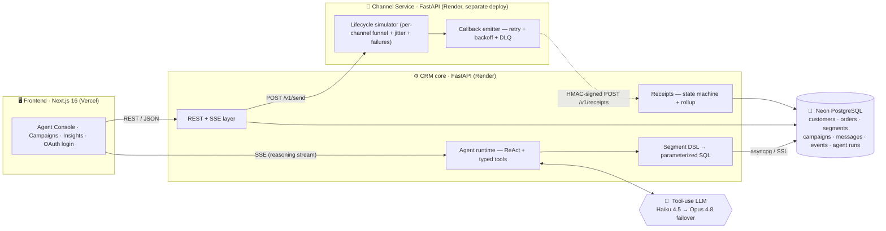
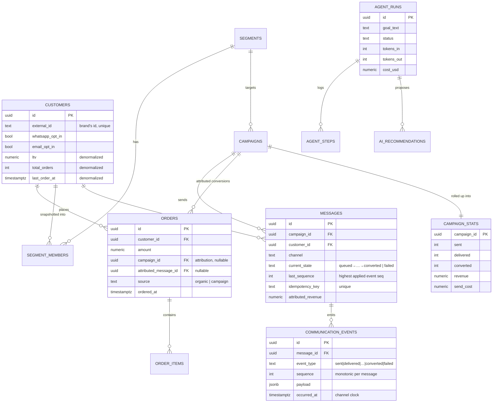
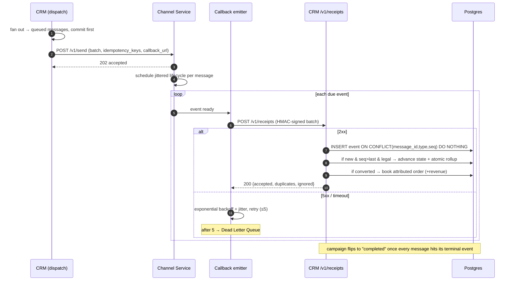
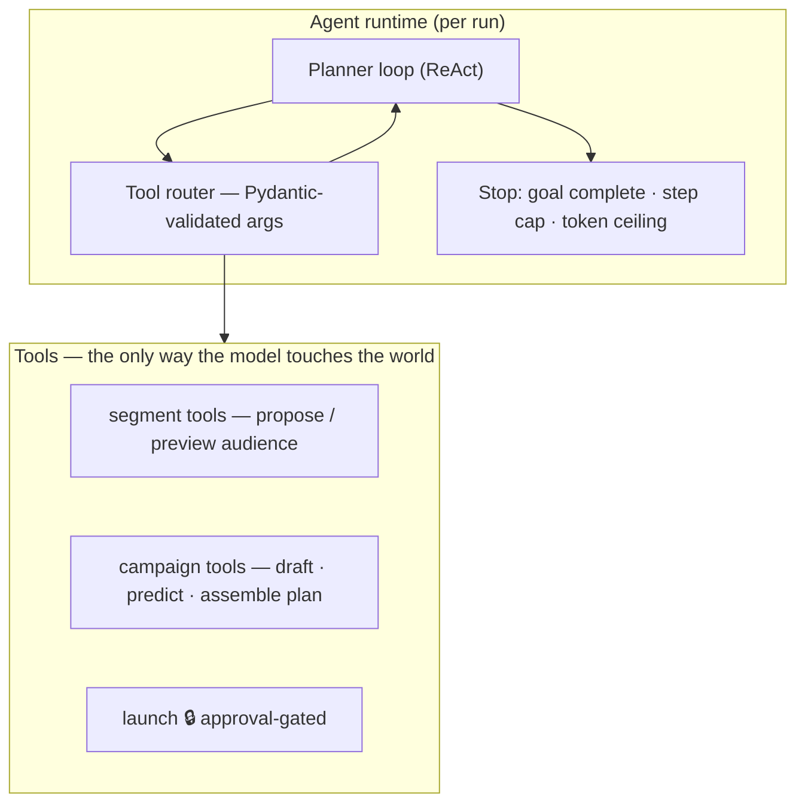
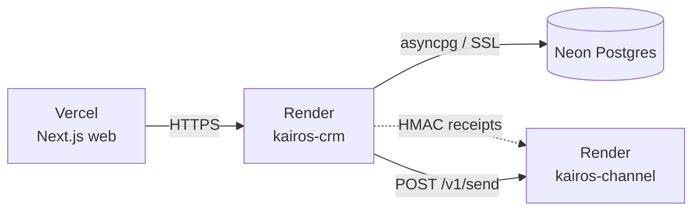

<div align="center">

# Kairos — Technical Design Document

### An autonomous-but-supervised growth-marketing agent on a clean, event-sourced core

<br/>

[](https://xeno-sde-six.vercel.app)
[](https://kairos-crm-79em.onrender.com/docs)
[](README.md)

</div>

> This document explains **what Kairos is, how it's built, and how it scales**. To keep it honest,
> every capability is tagged with its implementation status:
>
> | Tag | Meaning |
> |-----|---------|
> | ✅ **Built** | Implemented and running in this submission (live + covered by the 77-test suite) |
> | 🔭 **Designed for scale** | A deliberate forward design; the code leaves a clean seam for it, but it is **not** in this build |
>
> The guiding principle everywhere below: **the LLM proposes; deterministic, testable code disposes.**

---

## Table of contents

1. [Overview](#1-overview) · 2. [Product approach](#2-product-approach) · 3. [Architecture](#3-architecture) ·
4. [Data model](#4-data-model) · 5. [The send → receipt loop](#5-the-send--receipt-loop) ·
6. [The Segment DSL](#6-the-segment-dsl) · 7. [Agent design](#7-agent-design) ·
8. [Analytics & calibration](#8-analytics--calibration) · 9. [API reference](#9-api-reference) ·
10. [Scalability](#10-scalability-10k--1m) · 11. [Scope decisions](#11-scope--what-we-deliberately-did-not-build) ·
12. [Tech stack & deployment](#12-tech-stack--deployment) · 13. [AI-native dev workflow](#13-ai-native-development-workflow)

---

## 1. Overview

**Kairos** is an AI-native CRM for D2C / retail brands. A marketer states a goal in plain language —
*"Win back customers who haven't ordered in 60 days"* — and a marketing agent does the thinking, while a
human keeps the authority to send. End to end, a run:

1. **Analyses** the shopper base with real aggregate queries (never hallucinated numbers).
2. **Builds a segment** by emitting a typed, validated **Segment DSL** — never raw SQL.
3. **Recommends a channel** by predicted ROI and reachability (who actually has a WhatsApp opt-in / email).
4. **Drafts message variants** in the brand voice with personalization tokens.
5. **Predicts outcomes** — audience size, delivery, open / click / convert, revenue, ROAS — *before sending*.
6. **Proposes a complete campaign** that the human **approves or edits** — a hard gate, no autonomous blasting.
7. **Executes** through a separate stubbed **Channel Service**, ingests the async event callbacks, and updates live stats.
8. **Settles** — books real attributed orders on conversion and surfaces predicted-vs-actual calibration.


<div align="center"><sub>The glass-box agent console — every tool call and the exact data it pulled stream in live, ending in a plan held for approval.</sub></div>

### The one design decision that matters most

> **The LLM's only outputs are tool calls with Pydantic-validated arguments** (a Segment DSL, a channel
> choice, message text). Every *consequence* — SQL, size estimates, predictions, sends, revenue — is computed
> by ordinary, auditable, unit-tested code. That boundary is what makes the agent **shippable** rather than a
> science project, and it's the thread running through every section below.

---

## 2. Product approach

The brief offers several valid shapes for "AI-native" (assistant, chat-first, decision-support, full agent).
Three were considered:

| Option | Idea | Why not / why |
|--------|------|---------------|
| **A — CRM + AI assistant** | A classic dashboard where AI assists at steps ("suggest a segment," "draft a message"). | Lowest risk, but the AI is cosmetic — "bolted on," the exact thing the brief warns against. Low ceiling on scoping creativity. |
| **B — Chat-first CRM** | Everything happens in a conversation. | Modern and demoable, but hard to show segmentation depth and analytics in a transcript; risks reading as a thin model wrapper; conversation state is deceptively hard. |
| **C — Supervised agent ✅** | A goal-driven agent plans, segments, picks a channel, drafts, predicts, and executes — **behind a human approval gate**, with a **glass-box reasoning trace**. | Chosen. Directly answers "a true agent that takes a broad goal and executes," and the approval gate turns the usual *risk* of agents into a *strength*: production maturity. |

**The committed point of view:** *the marketer's job is to set goals and approve; the machine's job is to
reason and execute.* The AI is **load-bearing** — remove the agent and there is no product. That is the
definition of AI-native, and it is the one bet this project makes deeply rather than building ten features shallowly.

---

## 3. Architecture

A layered monorepo — **`api → service → repository → model`** — split across two FastAPI services and a
Next.js front end. The diagram shows the system **as built today**; §10 shows how each piece evolves under load.



| Decision | Choice | Reasoning / tradeoff |
|----------|--------|----------------------|
| **Two services** | CRM core + Channel Service as **separate deployments** | The brief makes this explicit, and it makes the boundary *real* (an HTTP + HMAC contract), not a function call — which forces the honest design (async callbacks, retries, ordering, idempotency). |
| **Backend** | **FastAPI**, async, Pydantic v2 | The workload is I/O-bound (DB + callback fan-in), so async gives real concurrency without threads. Pydantic *is* both the DSL validator and the API schema — one tool, double duty. |
| **Database** | **PostgreSQL** (Neon) | Relational shopper/order data; real SQL predicates for segmentation; a unique constraint + atomic increments for the receipt rollup. JSONB stores the DSL and event payloads. |
| **AI** | One tool-use LLM, **fast-primary with failover** | Haiku 4.5 handles structured planning cheaply (~$0.0075/run); transparently fails over to Opus 4.8 on a capacity error (429/5xx/overload). Cost control as a design choice. |
| **Dispatch (today)** | Synchronous fan-out from the request path, capped at demo scale | ✅ Simple and correct at this scope. The `message` row + `idempotency_key` is the seam to a queue-backed worker (§10). |

---

## 4. Data model

`communication_events` is the **append-only source of truth**; `campaign_stats` is a derived rollup. The
unique constraint on `(message_id, event_type, sequence)` is what makes at-least-once callback delivery
*effectively-once*. ✅ Every table below exists as a SQLAlchemy model in the build.



**Design notes**

- **Event-sourced stats.** `campaign_stats` is a derived rollup; it can always be rebuilt from the event log —
  which is exactly what makes idempotent re-processing safe.
- **Idempotency at two layers.** `messages.idempotency_key` (unique) dedups outbound sends; the unique
  `(message_id, event_type, sequence)` index dedups inbound callbacks.
- **Ordering via `sequence`.** A message advances `current_state` only when an event's `sequence > last_sequence`
  *and* the transition is legal (§5). Stale / out-of-order callbacks are recorded but never corrupt state.
- **Real attribution.** A `converted` event writes a real `orders` row tagged with `campaign_id` and
  `attributed_message_id`; campaign revenue rolls up from those rows, so `SUM(orders.amount) == campaign_stats.revenue`.
- **Deliberate denormalization.** `customers.ltv / total_orders / last_order_at` are denormalized so
  segmentation stays fast — the classic compute-once, read-often tradeoff. (Refreshed on a schedule; 🔭 a nightly
  job at scale.)

| Table | Key indexes | Why |
|-------|-------------|-----|
| `customers` | `(last_order_at)`, `(ltv)`, `(city)`, `(whatsapp_opt_in)` | segment filters + reachability |
| `orders` | `(customer_id, ordered_at)`, `(campaign_id)` | recency windows + attribution lookups |
| `messages` | `unique(idempotency_key)`, `(campaign_id, current_state)` | dedup + funnel rollups |
| `communication_events` | `unique(message_id, event_type, sequence)`, `(message_id, sequence)` | dedup + ordered apply |

---

## 5. The send → receipt loop

The system-design centerpiece. The CRM dispatches a batch; the Channel Service simulates each delivery
lifecycle and calls back asynchronously, reliably, and **at-least-once, out of order** — and the CRM stays
correct through it. ✅ Built end-to-end.

### Lifecycle & ordering contract


Each event carries a **monotonic `sequence`** per message. The CRM applies an event **iff** its `sequence`
exceeds the last applied one *and* the transition is legal — so duplicates and reordering can't corrupt state.

### The full round-trip



### The four hard problems, and how each is solved (✅ built)

| Problem | Mechanism |
|---------|-----------|
| **Ordering** (out-of-order callbacks) | A pure `decide()` state machine gated on a monotonic `sequence`; a late event is logged but can't regress `current_state`. |
| **Idempotency** (at-least-once delivery) | `unique(message_id, event_type, sequence)` + `INSERT … ON CONFLICT DO NOTHING`; state advances and stats accrue only on a genuinely new row. |
| **Concurrency** (callbacks racing the same `campaign_stats` row) | Per-batch deltas applied as a single atomic SQL `UPDATE … col = col + :delta` — serialized on the row lock, no lost updates. |
| **Failures / retries** | Channel side: 2xx = done, 4xx = dead-letter, 5xx/network = exponential backoff + jitter then DLQ. CRM side: always 2xx for a well-formed batch so retries fire only on genuine faults. |

> **Never stalls.** If the Channel Service is unreachable (e.g. a cold free-tier instance), approval falls back
> to a deterministic in-process simulation that writes the *same* events/stats/orders — so a launch can't hang.

---

## 6. The Segment DSL

The trust boundary between a probabilistic model and a production database. ✅ Built; covered by 15 unit tests.

- **The LLM never writes SQL.** It emits a typed JSON document (`SegmentDSL`): a versioned tree of `Condition`s
  (`field` / `op` / `value`) and boolean `Group`s (`all` / `any`).
- **Closed allowlist.** Only 9 fields are filterable (`total_spend`, `total_orders`, `ltv`, `avg_order_value`,
  `days_since_last_order`, `days_since_signup`, `whatsapp_opt_in`, `email_opt_in`, `city`); operators are
  constrained by field type. Anything off the list is rejected at validation.
- **Parameterized compile.** The compiler turns a validated document into a `WHERE` clause where every value is a
  **bound parameter** (`:p0`, `:p1`) — never string-concatenated. **Injection-safe by construction.**
- **Guard rails** against a runaway model: depth ≤ 5, ≤ 50 conditions.

```jsonc
{ "version": 1, "match": "all",
  "rules": [
    { "field": "days_since_last_order", "op": "gte", "value": 60 },
    { "field": "total_orders",          "op": "gte", "value": 1  }
  ] }
// → compiled: (… >= :p0) AND (customers.total_orders >= :p1)   params {p0: 60, p1: 1}
```

The agent and the UI both call exactly one endpoint to size an audience (`/v1/segments/preview`) — **one
audited path**, never two.

---

## 7. Agent design

A bounded **ReAct planner-executor**. The model reasons; every action is a tool call with Pydantic-validated
arguments; results feed back; the loop stops on a goal-complete signal or a step/token ceiling. Each step is
persisted to `agent_steps` and streamed to the UI as the glass-box trace. ✅ Built.



- **Tool-calling design.** Tools are typed Python functions with JSON schemas; the model can only emit valid
  calls, and invalid args are returned for self-correction.
- **The safety gate is in code, not the prompt.** Launch refuses unless `campaign.approved_by IS NOT NULL`.
- **LLM failover (✅).** `FallbackLLM` tries Haiku 4.5 first, transparently fails over to Opus 4.8 on a capacity
  error (429 / 5xx / overload / network); non-capacity errors (400/422) re-raise rather than mask a real bug.
- **Guardrails.** Step cap, token ceiling, DSL/tool-arg validation (no malformed segments, no SQL injection),
  a per-launch recipient cap at demo scale, and a full audit trail in `agent_runs` + `agent_steps`.

> 🔭 **Designed, not shipped:** a closed *learning* loop — persistent semantic memory of past campaigns (RAG) and
> channel×segment Beta-posterior priors that sharpen predictions over time. The schema (`ai_recommendations`,
> `agent_runs.outcome_summary`) and the calibration surface are in place as the seam; the priors/memory updater
> is future work. The calibration shown today is illustrative (see §8).

---

## 8. Analytics & calibration

| View | What it shows | Source |
|------|---------------|--------|
| **Campaign funnel** | Sent → Delivered → Opened → Read → Clicked → Converted (+ per-variant A/B) | `campaign_stats` + `messages` |
| **Channel ROI** | Deliverability, engagement, conversion, cost-per-conversion, ROAS by channel | events + `messages` cost |
| **Revenue / ROAS** | Attributed revenue from real `orders` − send cost | `orders(source='campaign')` |
| **Calibration** | **Predicted vs. actual ROAS** over campaigns — the "does it learn?" view | `campaign_stats` + `predicted_kpis` |

<table>
  <tr>
    <td width="50%"></td>
    <td width="50%"></td>
  </tr>
  <tr>
    <td align="center"><sub>Campaign detail — funnel, predicted-vs-actual, A/B variants, event timeline.</sub></td>
    <td align="center"><sub>Insights — channel ROI and the predicted-vs-actual calibration curve.</sub></td>
  </tr>
</table>

Stats are **event-sourced and incrementally rolled up** — fast reads, cheap writes, and rebuildable from the
event log if a rollup is ever wrong. 🔭 At scale these move to pre-aggregations / a columnar mirror (§10).

> **Honesty note:** the calibration curve is currently driven by seeded history plus the live funnel, so it's
> *illustrative* of the learning loop rather than the output of a trained predictor. The data model and the chart
> are the real seam a priors-based predictor would plug into.

---

## 9. API reference

CRM core — all routes under `/v1` ([interactive docs](https://kairos-crm-79em.onrender.com/docs)).

| Method | Endpoint | Purpose |
|--------|----------|---------|
| `POST` | `/v1/customers:bulk` · `/v1/orders:bulk` | Idempotent ingestion (upsert by `external_id`; maintains rollups) |
| `GET`  | `/v1/customers/stats` | Base summary (count, opt-ins, avg LTV) |
| `POST` | `/v1/segments/preview` | Compile DSL → SQL + **live** audience count (the safety boundary) |
| `POST` | `/v1/segments` | Persist a segment (optionally materialize a snapshot) |
| `POST` | `/v1/agent/run` | **SSE** stream of the agent's reasoning |
| `GET`  | `/v1/campaigns` · `/v1/campaigns/{id}` | List / detail (funnel, variants, timeline) |
| `POST` | `/v1/campaigns/{id}/approve` | Approval gate → dispatch → live settle |
| `POST` | `/v1/receipts` | HMAC-verified channel callback → state machine → rollup |
| `GET`  | `/v1/analytics/channel-roi` · `/calibration` · `/summary` | Insights data |

> **Channel Service** (separate deploy): `POST /v1/send`, `GET /v1/messages/{id}`,
> `POST /v1/admin/failure-rate` (live failure-injection knob), `GET /v1/admin/dead-letters`.

---

## 10. Scalability (10k → 1M)

The bet at this scope: **correctness over throughput**, with clean seams to graduate each piece independently.

| Dimension | ✅ **This build (~10k)** | 🔭 **100k** | 🔭 **1M** |
|-----------|--------------------------|-------------|-----------|
| **Send fan-out** | Synchronous batch from the request path, capped | Background worker, larger batches, concurrency limits | Partitioned worker pool, sharded by campaign; per-channel rate limits |
| **Receipt ingestion** | Synchronous handler, atomic rollup | Accept-then-process via **Redis Streams** + a consumer group | **Kafka**, partitioned by `message_id` for per-message ordering; dedup store in Redis |
| **Stats** | Atomic `UPDATE … += delta` | Same + periodic reconcile job | Stream → OLAP (ClickHouse / BigQuery) pre-aggregations |
| **Segmentation** | Compile DSL → SQL on the fly | Nightly denormalized RFM + covering indexes; cache by DSL hash | Read replica / columnar mirror; incremental membership |
| **LLM cost** | One plan-level call per run | Template-and-fill; LLM only on a sample | Per-recipient is template-driven (no per-message LLM); batch + semantic cache |

**Named bottlenecks → fixes** — *the reasoning the brief asks for:*

1. **Event write amplification** (~6 events/message → 6M rows at 1M sends) → time-partition `communication_events`,
   roll up then archive; move the hot path to a stream + OLAP.
2. **Single hot `campaign_stats` row** → already atomic; at scale, shard or move to a streaming aggregate.
3. **LLM cost if called per recipient** → **template-and-fill**: the agent writes *one* parameterized template;
   only a few personalized samples touch the model, so cost stays flat as the audience grows.
4. **Callback storms / ordering** → Kafka partitioning by `message_id` guarantees per-message order; dedup store
   absorbs duplicates.

> **The honest tradeoff:** *"At 1M I'd run a stream + OLAP + template-driven personalization. For this scope I
> chose a synchronous loop and a Postgres rollup — simpler, cheaper, and provably correct — and left clean seams
> (the event log, the message + idempotency key, the DSL hash) to graduate each piece. I intentionally did **not**
> introduce Kubernetes — it's pure ops cost here."*

---

## 11. Scope — what we deliberately did **not** build

The brief explicitly rewards deciding what *not* to build. These were conscious cuts, made to go deep on the
agent and the event loop rather than wide on CRUD surface area:

| Deliberately **not** built | Why it's the right cut |
|----------------------------|------------------------|
| Real WhatsApp / SMS / email providers | The brief says stub it; the simulator models the *interesting* part (the lifecycle loop) without integration noise. |
| Multi-tenant auth / RBAC | A single workspace demonstrates everything; auth here is undifferentiated plumbing (a sign-in gate exists; org/role hierarchy does not). |
| Drag-and-drop visual segment builder | The Segment DSL + agent *is* the segmentation story; a builder UI is polish, not substance. |
| Multi-step journeys / drip automations | One well-modeled send loop beats a shallow journey engine; it's named as the obvious next step. |
| A persistent learning system (priors / RAG memory) | The schema and calibration surface are in place as the seam; a trained predictor is future work (§7, §8). |
| Background queue + Redis Streams | Synchronous dispatch is correct at this scope; the message + idempotency key is the seam to swap it in (§10). |

---

## 12. Tech stack & deployment

| Layer | Technology |
|-------|------------|
| **Frontend** | Next.js 16 (App Router), React 19, TypeScript 5, Tailwind v4, TanStack Query 5, Recharts 3 |
| **Backend** | FastAPI × 2 (CRM core + Channel Service), Uvicorn, async SQLAlchemy 2, asyncpg over SSL |
| **Database** | PostgreSQL (Neon, `ap-southeast-1`, pooler endpoint) |
| **AI** | Tool-use LLM via API — Haiku 4.5 primary → Opus 4.8 failover |
| **Validation / auth** | Pydantic v2 / pydantic-settings · HMAC-signed cookie sessions (Web Crypto) + Google / GitHub OAuth + one-tap demo |
| **Deploy** | Vercel (web) · Render (both APIs, Singapore, one Blueprint) · Neon (DB) — all free tier |



The deployed CRM connects to the **same** Neon database that's already migrated and seeded, so there's no
deploy-time migration. Full walkthrough: **[DEPLOY.md](DEPLOY.md)**. One-tap **demo workspace** on the login
screen means the live deployment is reviewable with no account.

---

## 13. AI-native development workflow

An explicit evaluation axis — and a real part of how this was built:

- **Spec-first.** Each module started as a short written contract (this document is the spec) before code.
- **AI drafts, I direct and review.** An AI coding assistant scaffolded the DSL, tools, and tests from the spec;
  every diff was reviewed, tool schemas and edge cases corrected, and the result owned line by line.
- **Tests as the guardrail.** The DSL compiler and the receipt loop are the most-tested modules — including
  adversarial cases (duplicate, out-of-order, illegal transition, lost-update race) written by hand.
- **AI caught doing the wrong thing, then corrected.** Example: the first stats rollup had a lost-update race
  under concurrent callbacks (`sent` stuck at 1) — diagnosed from the symptom and moved to atomic SQL increments.
- **AI for the grunt work.** Migrations, the realistic Faker-based seed generator, and refactors.

> **The principle:** AI is a pair, not an author. The structure — a typed DSL, validated tools, an idempotent
> ordered consumer — is exactly what makes AI-generated code *safe to ship*, and every line is defensible.

---

<div align="center"><sub>Kairos — agent reasoning you can audit, AI output you can trust. Built for the Xeno Engineering Take-Home, 2026.</sub></div>
