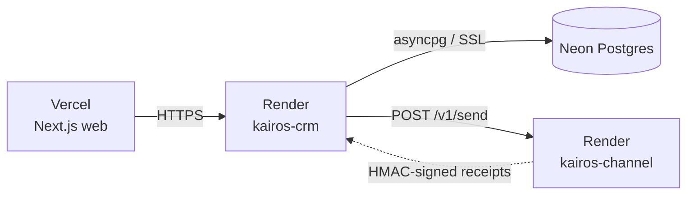

# Deploying Kairos

Three pieces — **Neon** (Postgres), two **FastAPI** services on **Render**, and the **Next.js** app on
**Vercel**. The deployed CRM connects to the *same* Neon database that's already migrated and seeded, so
there's **no migration step at deploy time**.

| Piece | Host | What it is | Free tier |
|-------|------|------------|:---------:|
| Web | **Vercel** | Next.js front end (root dir `apps/web`) | ✅ |
| CRM core | **Render** | FastAPI API + agent + receipt loop (`kairos-crm`) | ✅ |
| Channel Service | **Render** | Delivery simulator + signed callbacks (`kairos-channel`) | ✅ |
| Database | **Neon** | PostgreSQL, `ap-southeast-1`, pooler endpoint | ✅ |

> **Live instances:** web → [xeno-sde-six.vercel.app](https://xeno-sde-six.vercel.app) · API →
> [kairos-crm-79em.onrender.com](https://kairos-crm-79em.onrender.com/docs). Free-tier services sleep after
> ~15 min idle; the **first** request cold-starts in ~30–60 s, then it's instant.



---

## 1. Backend — Render (Blueprint)

1. Push to GitHub (done): `github.com/blazingarrows1525/xeno-sde`.
2. Render → **New > Blueprint** → pick this repo. Render reads [`render.yaml`](render.yaml) and proposes
   **kairos-crm** and **kairos-channel**.
3. On **kairos-crm**, set the secrets marked `sync: false`:

   | Key | Required | Value |
   |-----|:--------:|-------|
   | `DATABASE_URL` | ✅ | your Neon **pooler** string (`postgresql://…?sslmode=require`) |
   | `ANTHROPIC_API_KEY` | for live agent | `sk-ant-…` (unset → a scripted demo agent runs, so it still works) |
   | `CORS_ORIGINS` | — | leave as `http://localhost:3000` — `app/main.py` already admits any `*.vercel.app` origin via regex |
   | `CHANNEL_SERVICE_URL` | for live loop | the channel's URL (you'll know it after step 4 — see [§3](#3-the-two-service-send-loop)) |
   | `CRM_PUBLIC_URL` | for live loop | this service's own URL (the channel calls it back — also after step 4) |

   `RECEIPT_HMAC_SECRET` (CRM) is auto-generated and **copied into the channel's `HMAC_SECRET`** by
   `render.yaml` (`fromService`), so signatures verify on both ends — `kairos-channel` needs no manual config.
4. **Apply** → both build from their Dockerfiles. When live, copy the CRM URL
   (e.g. `https://kairos-crm.onrender.com`) and verify `GET /health` returns `{"status":"ok"}`.

---

## 2. Frontend — Vercel

1. Vercel → **Add New > Project** → import the same repo.
2. Set **Root Directory** to `apps/web` (Next.js is auto-detected).
3. Add environment variables (only the first is required):

   | Key | Required | Value |
   |-----|:--------:|-------|
   | `NEXT_PUBLIC_API_URL` | ✅ | your CRM URL from step 1 (unset → the UI serves bundled mock data) |
   | `NEXT_PUBLIC_BASE_URL` | for OAuth | your Vercel URL, e.g. `https://kairos-web.vercel.app` |
   | `AUTH_SECRET` | for sessions | any long random string (signs the session cookie) |
4. **Deploy**, then copy the resulting URL.

### Login / OAuth

The app is gated by a sign-in screen that always offers a **one-tap demo workspace** (no account, no config),
so the live deployment is reviewable out of the box. To enable real OAuth, set a provider's credentials and
register its callback URL:

| Provider | Vercel env vars | Callback URL to register |
|----------|-----------------|--------------------------|
| Google | `GOOGLE_CLIENT_ID`, `GOOGLE_CLIENT_SECRET` | `<base>/api/auth/callback/google` |
| GitHub | `GITHUB_CLIENT_ID`, `GITHUB_CLIENT_SECRET` | `<base>/api/auth/callback/github` |

(`<base>` = your `NEXT_PUBLIC_BASE_URL`.) A provider's button only appears wired when its credentials are
present; otherwise users continue with the demo workspace.

---

## 3. The two-service send loop

Approving a campaign dispatches it to the **separate Channel Service**, which simulates each delivery
lifecycle and calls back into the CRM's `/v1/receipts` with HMAC-signed events. To run this **live in
production**, set two URLs on **kairos-crm** once both services have public URLs (from step 4 above):

| Key | Value |
|-----|-------|
| `CHANNEL_SERVICE_URL` | the channel's public URL, e.g. `https://kairos-channel.onrender.com` |
| `CRM_PUBLIC_URL` | the CRM's own public URL (the channel calls this back) |

The shared HMAC secret is already wired: `render.yaml` copies the CRM's `RECEIPT_HMAC_SECRET` into the
channel's `HMAC_SECRET` via `fromService`, so callbacks verify on both ends.

> **Never stalls.** If `CHANNEL_SERVICE_URL` is unset or the channel is asleep (free-tier cold start),
> approval **falls back** to a deterministic in-process simulation that writes the same events / stats /
> attributed-orders tables — so a launch can't hang.

**Locally:** run the channel on `:8001` and the CRM with `CHANNEL_SERVICE_URL=http://localhost:8001` and
`CRM_PUBLIC_URL=http://localhost:8000`. The two HMAC secrets must match — set the channel's `HMAC_SECRET`
equal to the CRM's `RECEIPT_HMAC_SECRET` (an `apps/channel/.env` with that one line is enough).

---

## 4. Verify the loop is closed

- The web app fetches **live data** from the CRM; if the API is unreachable it transparently falls back to
  bundled demo data, so the deployment is never blank.
- **CORS** works out of the box for `*.vercel.app` (regex in [`app/main.py`](apps/crm/app/main.py)). Only a
  **custom domain** needs adding to the CRM's `CORS_ORIGINS` (comma-separated) + a redeploy.
- Smoke test: open the live web app → one-tap demo workspace → run the agent → approve a campaign → watch the
  funnel settle. `GET /health` on the CRM should return `{"status":"ok"}`.

---

## Run the containers locally (optional)

```bash
docker build -t kairos-crm apps/crm && \
  docker run -p 8000:8000 --env-file apps/crm/.env kairos-crm

docker build -t kairos-channel apps/channel && \
  docker run -p 8001:8001 kairos-channel
```

## Notes

- The deployed CRM reads config from **environment variables** (no `.env` file needed in the container).
- **Fresh database?** The schema bootstraps from the SQLAlchemy models via `create_all` on first seed
  (`python -m scripts.seed` → `scripts.seed_campaigns`); the existing Neon DB is already migrated and seeded,
  so a standard deploy skips this entirely.
