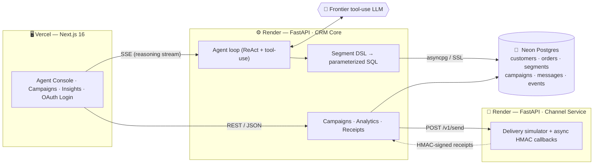
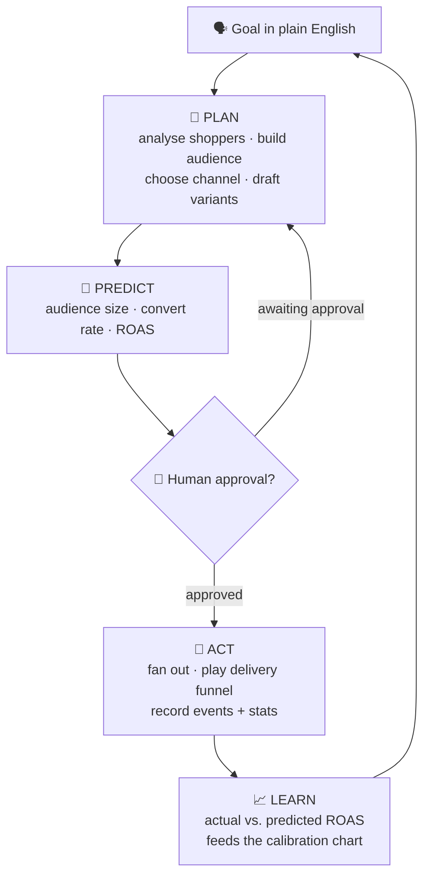
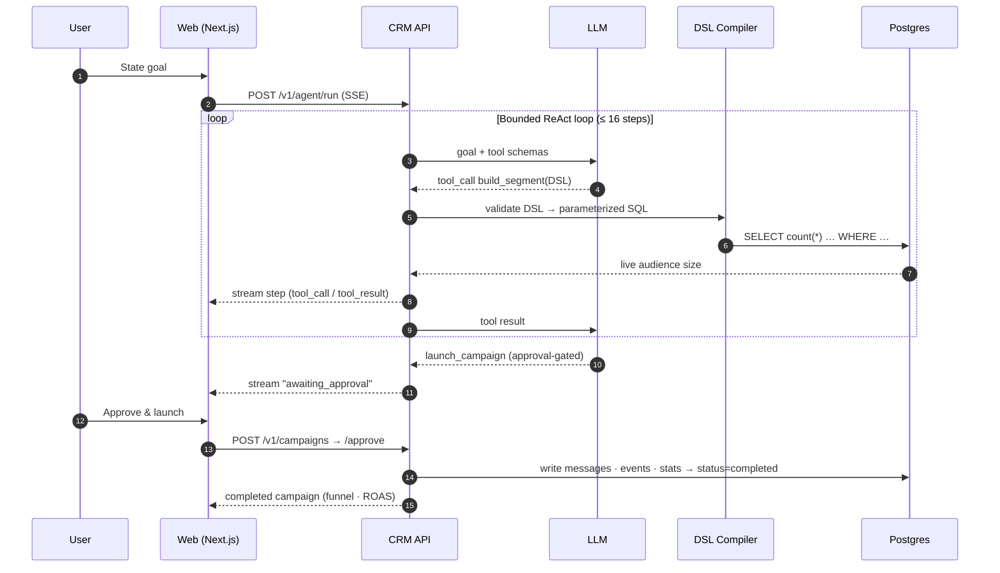
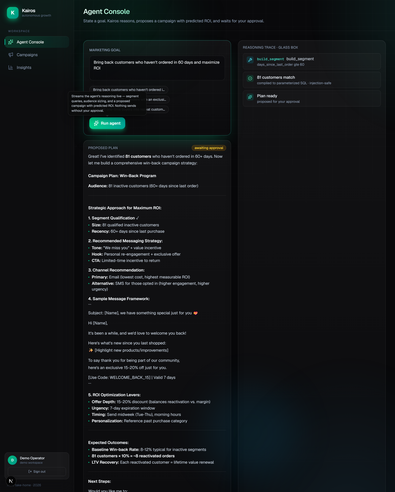
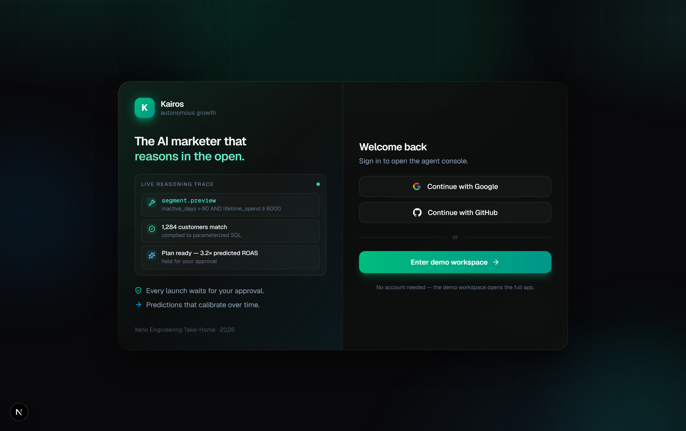
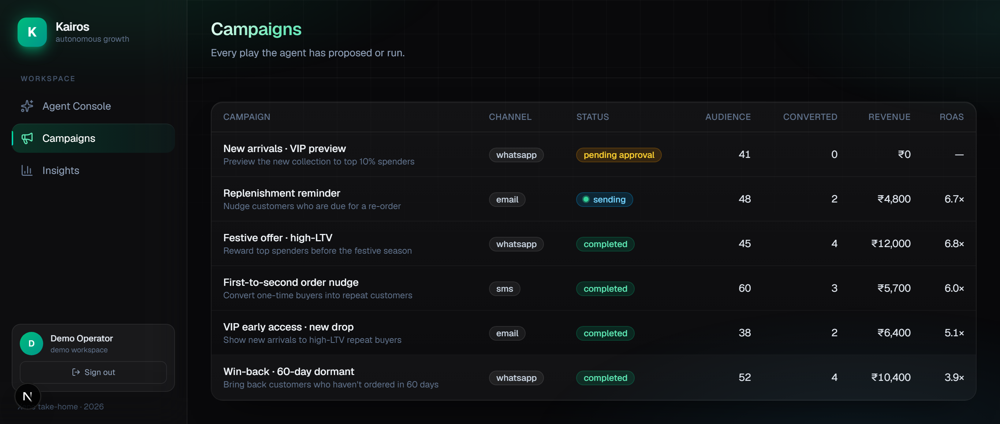
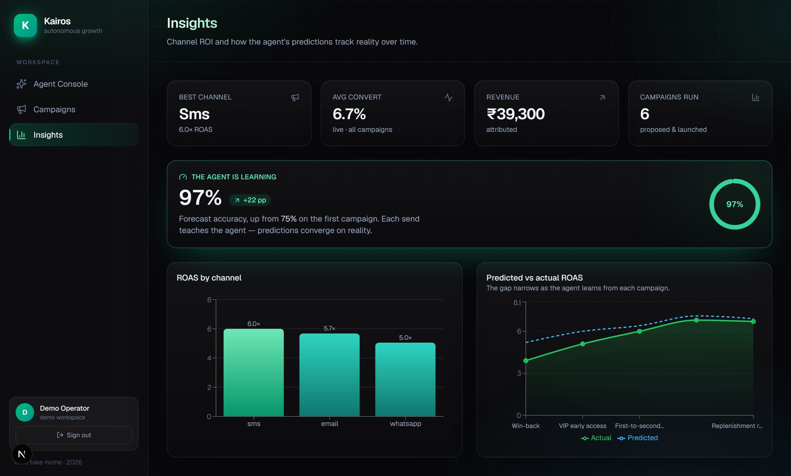
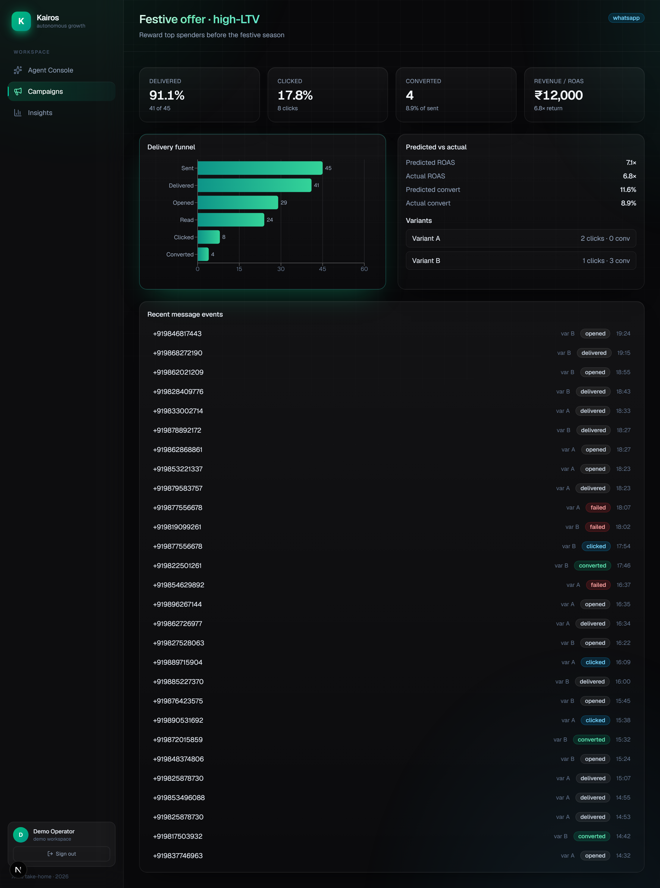
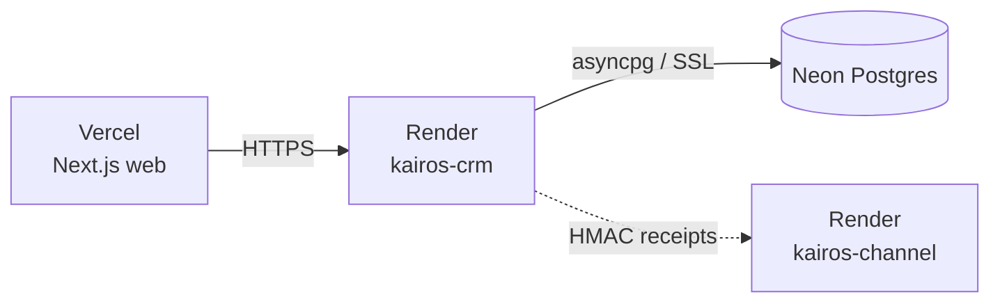

<div align="center">

# Kairos — AI-Native Mini CRM

### An autonomous-but-supervised growth marketer that **plans, predicts, and learns**

State a goal in plain English — *“Win back customers who haven’t ordered in 60 days”* — and Kairos
analyses your shoppers, builds an audience, recommends a channel, **predicts the outcome before
sending**, waits for your approval, runs the campaign, and **calibrates** as real events arrive.

<br/>

[](https://xeno-sde-six.vercel.app)
[](https://kairos-crm-79em.onrender.com/docs)
[](BLUEPRINT.md)

<br/>


</div>

> [!NOTE]
> **The API runs on a free Render tier and sleeps after ~15 min idle.** The **first** request may
> cold-start for 30–60 s, then it’s instant. The agent runs on a live LLM against a live Neon
> Postgres seeded with **200 shoppers** and **6 campaigns**. No account needed — the login screen
> always offers a **one-tap demo workspace**.

Built for the **Xeno Engineering Take-Home (2026)**.

---

## Table of contents

1. [The bet](#-the-bet) · 2. [What it solves](#-what-it-solves) · 3. [Highlights](#-key-highlights) ·
4. [Architecture](#-architecture) · 5. [How it works](#-how-it-works) · 6. [Project structure](#-project-structure) ·
7. [Tech stack](#-tech-stack) · 8. [Core features](#-core-features) · 9. [Screens](#-screens--figures) ·
10. [Local dev](#-local-development) · 11. [Testing](#-testing) · 12. [Deployment](#-deployment) ·
13. [Status & limitations](#-status--known-limitations) · 14. [Roadmap](#-roadmap)

---

## 🎯 The bet

Most take-homes build *“a CRM with a **Generate message** button.”* Kairos is the other thing: an
agent that runs a continuous **Plan → Act → Learn** loop, keeps a human in the approval seat, and
*visibly gets smarter* every campaign.

**The three things worth looking at:**

| # | What | Why it’s different |
|---|------|--------------------|
| **1** | **The glass-box agent** | Type a goal and watch every reasoning step, tool call, and the *exact data it pulled* stream into the UI in real time over Server-Sent Events. No black box. |
| **2** | **The Segment DSL compiler** | The LLM **never writes SQL.** It emits a typed, validated JSON spec; a deterministic compiler turns it into **parameterized** SQL. Injection-safe *by construction*, auditable, and covered by **15 unit tests.** |
| **3** | **The calibration chart** | Predicted vs. actual ROAS, converging over campaigns. Proof the system *learns*, not just *generates*. |

---

## 💡 What it solves

D2C marketers live between two bad options: rigid rule-builders that can’t reason, or “AI” tools
that generate copy but can’t be trusted near a production database. Kairos targets the gap:

- **Reasoning you can audit** — the agent’s every step is streamed and persisted, not hidden behind a single response.
- **AI output that’s safe to execute** — model proposals are constrained to a validated DSL, so they’re testable like any other code path.
- **Decisions a human still owns** — launches are gated behind an explicit approval that lives *in code*, not in a prompt.
- **A system that improves** — each completed campaign feeds the predicted-vs-actual calibration loop.

---

## ⭐ Key highlights

- 🧠 **Bounded ReAct agent** — a step-capped Plan→Act→Learn loop with a hard human-approval gate.
- 🛡️ **Typed Segment DSL → parameterized SQL** — a closed allowlist of fields/operators; injection-safe by construction.
- 📡 **Real-time glass box** — reasoning streamed to the browser as Server-Sent Events.
- 🔁 **Model failover** — a fast primary model with transparent failover to a stronger model on capacity errors (429 / 5xx / timeout).
- 📊 **Calibration analytics** — predicted vs. actual ROAS converging over time, plus channel-ROI breakdowns.
- 🔐 **Auth that’s always reviewable** — Google / GitHub OAuth *and* a one-tap demo workspace; HMAC-signed cookie sessions that run in both Edge and Node.
- 🧱 **Idempotent ingestion + ordered event processing** — bulk upserts and an HMAC-verified receipt state machine that survives out-of-order, at-least-once callbacks.
- 💰 **Real revenue attribution** — a conversion books an actual campaign-attributed order with a realistic order value; campaign revenue and ROAS roll up from real order rows, not a flat constant.
- 🎨 **Production-grade frontend** — Next.js 16 / React 19 / Tailwind v4 with spring-physics motion, skeleton loading, and full mobile responsiveness.

---

## 🏗 Architecture

A layered monorepo: **`api → service → repository → model`**. The LLM only ever emits
schema-validated DSL, so AI output is testable like any other code path.



> [!TIP]
> **Start here:** [`apps/crm/app/segments/`](apps/crm/app/segments/) — the DSL and its compiler.
> The agent proposes a constrained spec; this module compiles it to safe SQL. **That boundary is
> the whole safety story.**

---

## ⚙️ How it works

### The Plan → Act → Learn loop



### A single agent run (sequence)



### Major components & responsibilities

| Component | Responsibility | Key tech |
|-----------|----------------|----------|
| **Agent runtime** ([`agents/runtime.py`](apps/crm/app/agents/runtime.py)) | Bounded ReAct loop; approval gate in code; emits a streamed step record per thought/tool call | Async generators |
| **Segment DSL** ([`segments/dsl.py`](apps/crm/app/segments/dsl.py)) | Typed, validated audience language; closed field/operator allowlist; depth & complexity guards | Pydantic v2 |
| **DSL compiler** ([`segments/compiler.py`](apps/crm/app/segments/compiler.py)) | Validated DSL → **parameterized** SQL `WHERE` / count / select-ids | SQLAlchemy `text()` binds |
| **Campaigns** ([`api/campaigns.py`](apps/crm/app/api/campaigns.py)) | CRUD, approval gate, approve → fan out + dispatch to the Channel Service → live receipt callbacks settle the campaign | FastAPI |
| **Outbound dispatch** ([`events/dispatch.py`](apps/crm/app/events/dispatch.py)) | Fans a campaign out to per-recipient messages and POSTs the batch to the Channel Service `/v1/send` | httpx |
| **Receipt rollup** ([`api/receipts.py`](apps/crm/app/api/receipts.py)) | HMAC-verified callbacks → state machine → atomic, lost-update-safe stat increments; `ON CONFLICT` idempotency; a conversion books a real campaign-attributed order | SQLAlchemy |
| **Receipt state machine** ([`events/state_machine.py`](apps/crm/app/events/state_machine.py)) | Pure `decide()` — advances message state only on legal, in-order, non-duplicate events | Pure function |
| **Send simulation (fallback)** ([`events/simulate.py`](apps/crm/app/events/simulate.py)) | Deterministic in-process funnel used only when the Channel Service is unreachable, so a launch never stalls | Deterministic, seeded |
| **Channel Service** ([`apps/channel`](apps/channel)) | Standalone delivery simulator: async lifecycle, HMAC-signed callbacks, retries, dead-letters | FastAPI + httpx |

---

## 📁 Project structure

```
apps/
├─ crm/                 FastAPI — CRM core (ingestion, DSL, campaigns, agent, analytics)
│  ├─ app/
│  │  ├─ agents/        Plan→Act→Learn runtime + tools (build_segment, launch_campaign) + LLM clients
│  │  ├─ segments/      ⭐ Segment DSL + compiler — read this first
│  │  ├─ api/           REST routers + the SSE agent endpoint
│  │  ├─ events/        outbound dispatch · receipt state machine · send-sim fallback
│  │  ├─ models/        SQLAlchemy models
│  │  └─ core/          config (env + Neon URL normalization) · async DB engine
│  ├─ scripts/          seed generators + backfill (seed, seed_campaigns, process_pending)
│  ├─ migrations/       Alembic
│  └─ tests/            58 unit tests
├─ channel/             FastAPI — Channel Service (delivery lifecycle + HMAC callbacks), 19 tests
└─ web/                 Next.js 16 — Agent Console, Campaigns, Insights, OAuth login
   ├─ app/              App-Router routes + /api/auth handlers
   ├─ components/       design system, charts, reasoning trace, app shell
   └─ lib/              api client · auth (HMAC cookie) · types · mock fallback
render.yaml             Render Blueprint (both FastAPI services)
DEPLOY.md               full deployment walkthrough
BLUEPRINT.md            full design + scalability plan (10k → 1M)
```

| Directory | Purpose |
|-----------|---------|
| [`apps/crm/app/segments`](apps/crm/app/segments) | The safety boundary — typed DSL + SQL compiler |
| [`apps/crm/app/agents`](apps/crm/app/agents) | The agent loop, its tools, and the LLM client + failover chain |
| [`apps/crm/app/events`](apps/crm/app/events) | Outbound dispatch to the Channel Service, the ordered/idempotent receipt state machine, and the send-sim fallback |
| [`apps/channel/app`](apps/channel/app) | A realistic, self-contained delivery microservice |
| [`apps/web/components`](apps/web/components) | The reusable design system (buttons, cards, tooltips, charts, trace) |

---

## 🧰 Tech stack

| Layer | Technology | Why |
|-------|------------|-----|
| **Frontend** | Next.js 16 (App Router), React 19, TypeScript 5 | Modern RSC + streaming; type safety end-to-end |
| **Styling / motion** | Tailwind CSS v4, custom CSS spring system | Restrained glass aesthetic; physics-based interactions |
| **Data / charts** | TanStack Query 5, Recharts 3 | Cache-aware fetching; declarative funnel & calibration charts |
| **Backend** | FastAPI × 2 (CRM core + Channel Service), Uvicorn | Async, typed, auto-generated OpenAPI |
| **ORM / DB driver** | SQLAlchemy 2 (async), asyncpg over SSL | Async sessions against hosted Postgres |
| **Database** | PostgreSQL (Neon, `ap-southeast-1`) | Serverless Postgres with a pooler endpoint |
| **AI** | Frontier tool-use LLM via API | Streamed ReAct loop; the model emits **validated DSL, never raw SQL** |
| **Validation** | Pydantic v2 / pydantic-settings | DSL schema, request/response models, env config |
| **Auth** | Custom HMAC-signed cookie (Web Crypto) + OAuth | Runs in Edge + Node; Google / GitHub / one-tap demo |
| **Migrations / seeds** | Alembic, Faker | Schema versioning; synthetic shoppers & campaigns |
| **Deploy** | Vercel (web) · Render (both APIs, Singapore) · Neon (DB) | All free tier |

---

## 🚀 Core features

| Feature | Purpose | Implementation notes |
|---------|---------|----------------------|
| **Glass-box agent console** | Watch the agent reason in real time | `POST /v1/agent/run` streams SSE; each step rendered live in [`reasoning-trace.tsx`](apps/web/components/reasoning-trace.tsx) |
| **Segment DSL → SQL** | Safe, LLM-proposed audiences | Closed allowlist of 9 fields × typed operators; depth ≤ 5, ≤ 50 conditions; values always bound, never concatenated |
| **Live audience preview** | Know the segment size before committing | `POST /v1/segments/preview` compiles + counts against the live `customers` table |
| **Human approval gate** | Nothing sends without sign-off | `requires_approval` tools short-circuit to `awaiting_approval`; the gate lives in [`runtime.py`](apps/crm/app/agents/runtime.py), not the prompt |
| **Approve → dispatch → settle** | Turn a plan into a finished campaign | Approval fans the campaign out to per-recipient messages, dispatches them to the **separate Channel Service**, and the async receipt callbacks roll up the funnel live, **book a real attributed order on each conversion**, and flip the campaign to `completed` (deterministic in-process fallback if the channel is unreachable) |
| **Campaign detail** | Inspect a run end-to-end | Delivery funnel, A/B variants, and a recent-events timeline |
| **Insights & calibration** | Prove the agent learns | Channel-ROI bars + predicted-vs-actual ROAS line; aggregate summary cards |
| **Model failover** | Resilience under load | `FallbackLLM` tries a fast primary model, transparently fails over to a stronger model on capacity errors; non-capacity errors re-raise |
| **Idempotent ingestion** | Safe re-imports | `POST /v1/customers:bulk` & `/orders:bulk` upsert by `external_id` and maintain denormalized rollups |
| **Ordered receipts** | Correct stats under at-least-once delivery | HMAC-verified callbacks → `decide()` advances state only on legal, in-order, non-duplicate events |
| **Auth + demo** | Reviewable out of the box | OAuth (Google/GitHub) when configured; always-on one-tap demo workspace |

### REST API at a glance

> CRM core — all routes under `/v1` ([interactive docs](https://kairos-crm-79em.onrender.com/docs)).

| Method | Endpoint | Description |
|--------|----------|-------------|
| `POST` | `/v1/customers:bulk` | Idempotent customer upsert by `external_id` |
| `POST` | `/v1/orders:bulk` | Ingest orders, auto-update customer rollups |
| `GET`  | `/v1/customers/stats` | Customer summary (count, opt-ins, avg LTV) |
| `POST` | `/v1/segments/preview` | Compile DSL → SQL + live audience count |
| `POST` | `/v1/segments` | Persist a segment (optionally materialize members) |
| `POST` | `/v1/agent/run` | **SSE** stream of the agent’s reasoning |
| `GET`  | `/v1/campaigns` · `/v1/campaigns/{id}` | List / detail (funnel, variants, timeline) |
| `POST` | `/v1/campaigns/{id}/approve` | Approval gate → send simulation → `completed` |
| `POST` | `/v1/receipts` | HMAC-verified delivery callback → state machine |
| `GET`  | `/v1/analytics/channel-roi` · `/calibration` · `/summary` | Insights data |

> Channel Service (separate port): `POST /v1/send`, `GET /v1/messages/{id}`, `POST /v1/admin/failure-rate`, `GET /v1/admin/dead-letters`.

---

## 🖼 Screens & figures

> Captured from the running app. The live demo is one click away —
> **[xeno-sde-six.vercel.app](https://xeno-sde-six.vercel.app)** (one-tap demo workspace, no account needed).

#### 🧠 The glass-box agent console



> State a goal → the agent’s tool calls and the **exact data it pulled** stream in live, and a full
> campaign plan with predicted ROAS is assembled **for your approval** — nothing sends on its own.

#### 🔐 Sign-in



> OAuth (Google / GitHub) **plus** an always-on demo workspace, so the deployment is reviewable out of the box.

#### 📊 Campaigns & Insights

<table>
  <tr>
    <td width="50%"></td>
    <td width="50%"></td>
  </tr>
  <tr>
    <td align="center"><em>Campaigns — every play, with live status, audience, conversions, revenue & ROAS.</em></td>
    <td align="center"><em>Insights — channel ROI and the predicted-vs-actual <strong>calibration</strong> curve.</em></td>
  </tr>
</table>

#### 🔎 Campaign detail



> Delivery funnel, predicted-vs-actual panel, A/B variants, and the per-message event timeline.

---

## 💻 Local development

> [!IMPORTANT]
> **Prerequisites:** Node 20+, Python 3.10+, and a PostgreSQL connection string (a Neon free DB
> works great). Commands below use **Windows / PowerShell**; on macOS/Linux use `.venv/bin/python`.

Two servers run against the same Postgres. Backend secrets live in **`apps/crm/.env`** (gitignored).

### 1 — CRM API → http://127.0.0.1:8000

```powershell
cd apps/crm
python -m venv .venv
.\.venv\Scripts\python.exe -m pip install -r requirements.txt

# apps/crm/.env  →  DATABASE_URL=...   ANTHROPIC_API_KEY=...
.\.venv\Scripts\python.exe run.py        # sets the Windows selector loop + loads .env
# health → http://127.0.0.1:8000/health   ·   docs → http://127.0.0.1:8000/docs
```

### 2 — Web → http://localhost:3000

```powershell
cd apps/web
npm install
# apps/web/.env.local  →  NEXT_PUBLIC_API_URL=http://127.0.0.1:8000
npm run dev
```

### 3 — Seed data (first run)

```powershell
cd apps/crm
.\.venv\Scripts\python.exe -m scripts.seed --customers 200 --wipe
.\.venv\Scripts\python.exe -m scripts.seed_campaigns --wipe
```

### Environment variables

**CRM (`apps/crm/.env`)**

| Variable | Required | Default | Purpose |
|----------|:--------:|---------|---------|
| `DATABASE_URL` | ✅ (prod) | local Postgres | Neon pooler string; libpq params auto-normalized for asyncpg/SSL |
| `ANTHROPIC_API_KEY` | for live agent | *(empty)* | Key for the agent’s LLM. **Unset → a scripted demo agent runs**, so the app still works |
| `CORS_ORIGINS` | — | `http://localhost:3000` | Extra allowed origins (any `*.vercel.app` is already allowed via regex) |
| `RECEIPT_HMAC_SECRET` | — | dev value | Verifies Channel Service receipt callbacks |
| `CHANNEL_SERVICE_URL` | — | `http://localhost:8001` | Channel base URL (for the live send loop) |

> Tunable safety rails (defaults shown): `AGENT_MAX_STEPS=16`, `AGENT_MAX_TOKENS=120000`, `CAMPAIGN_MAX_RECIPIENTS=50000`.

**Web (`apps/web/.env.local`)**

| Variable | Required | Purpose |
|----------|:--------:|---------|
| `NEXT_PUBLIC_API_URL` | recommended | CRM URL. **Unset → the UI serves bundled mock data** |
| `NEXT_PUBLIC_BASE_URL` | prod | This app’s public URL, used to build OAuth callbacks |
| `AUTH_SECRET` | prod | Signs the session cookie (any long random string) |
| `GOOGLE_CLIENT_ID` / `GOOGLE_CLIENT_SECRET` | optional | Lights up the Google button |
| `GITHUB_CLIENT_ID` / `GITHUB_CLIENT_SECRET` | optional | Lights up the GitHub button |

> [!WARNING]
> **Common pitfalls:** (1) Don’t run `npm run build` while `next dev` is live — it can corrupt the
> shared `.next` cache. (2) On Windows, the CRM must use the selector event loop — always launch via
> `run.py`, which sets it before importing the app. (3) Neon’s `-pooler` endpoint disables prepared
> statements; the config detects this and turns off statement caching automatically.

---

## 🧪 Testing

The DSL-compiler suite is the one that matters most — it proves the LLM’s output can **only** ever
become safe, parameterized SQL.

```powershell
# CRM (58 tests)
cd apps/crm
.\.venv\Scripts\python.exe -m pip install -r requirements.txt -r requirements-dev.txt
.\.venv\Scripts\python.exe -m pytest -q

# Channel Service (19 tests)
cd ../channel
python -m pytest -q
```

| Suite | File | Tests | Covers |
|-------|------|:-----:|--------|
| **DSL compiler** | `test_segment_compiler.py` | 15 | Allowlist validation, parameterization, AND/OR nesting, depth & complexity guards |
| **State machine** | `test_state_machine.py` | 9 | Event ordering, idempotency, illegal/stale transitions |
| **Agent runtime** | `test_agent_runtime.py` | 9 | ReAct loop, approval gate, **LLM failover** |
| **Receipt HMAC** | `test_receipts_hmac.py` | 6 | Channel-signature compatibility, tamper/missing rejection, endpoint 401 |
| **Models** | `test_models.py` | 5 | SQLAlchemy models & relationships |
| **API smoke** | `test_api_smoke.py` | 3 | App wiring, `/health`, segment preview validation |
| **Dispatch payload** | `test_dispatch_payload.py` | 2 | CRM→Channel `/v1/send` body matches the channel contract |
| **Attribution** | `test_attribution.py` | 9 | Conversion→order seam, varied order values, campaign/message linkage |
| **Channel Service** | `tests/` (7 files) | 19 | Lifecycle simulation, send API, HMAC signing, store idempotency, delivery, terminal flag, conversion value |
| | | **77** | **total** |

> Tests run with **no external dependencies** — the DB engine is created lazily and the agent uses a
> scripted LLM stand-in, so the whole contract is unit-testable offline.

---

## 🌐 Deployment

Three pieces; the deployed CRM connects to the **same** Neon database that’s already migrated and
seeded, so there’s no deploy-time migration.



| Target | Service | Notes |
|--------|---------|-------|
| **Vercel** | `apps/web` | Root directory `apps/web`; Next.js auto-detected |
| **Render** | `kairos-crm` + `kairos-channel` | One **Blueprint** ([`render.yaml`](render.yaml)) stands up both Docker services (Singapore) |
| **Neon** | PostgreSQL | `ap-southeast-1`, pooler endpoint |

**Deploy checklist**

1. **Render → New → Blueprint** → select the repo (`render.yaml` proposes both services).
2. On **kairos-crm**, set `DATABASE_URL`, `ANTHROPIC_API_KEY`, `CORS_ORIGINS`. HMAC secrets auto-generate.
3. Apply → both build from their Dockerfiles → verify `GET /health` returns `{"status":"ok"}`.
4. **Vercel → Add Project** → root `apps/web` → set `NEXT_PUBLIC_API_URL` to the CRM URL (+ `AUTH_SECRET`, optional OAuth).
5. Deploy. CORS for `*.vercel.app` is already handled in [`app/main.py`](apps/crm/app/main.py).

Full walkthrough (including local Docker and OAuth setup): **[DEPLOY.md](DEPLOY.md)**.

---

## 📌 Status & known limitations

**Live in production today**

- ✅ OAuth / demo **login gate** (HMAC-signed cookie sessions)
- ✅ **Agent loop** — real LLM, streamed glass-box reasoning over SSE, with model failover
- ✅ **Segment DSL** — preview → compile → live count against real shoppers
- ✅ **Campaigns** — list, detail (funnel · A/B variants · timeline), and **approve → dispatch → live funnel → completed with real ROAS**
- ✅ **Insights** — channel ROI + predicted-vs-actual calibration + summary
- ✅ **Responsive, polished UI** across desktop and mobile

**The two-service send loop is wired end-to-end**

- ✅ Approving a campaign fans it out to per-recipient messages and **POSTs them to the separate
  Channel Service** (`/v1/send`). The channel simulates each lifecycle and **calls back to
  `/v1/receipts`** with HMAC-signed event batches; the CRM verifies, runs the ordering **state
  machine**, and rolls the funnel up with **atomic, lost-update-safe** stat increments. The campaign
  settles to `completed` once every message hits its terminal event. The funnel fills in **live** in
  the UI while it sends.
- ✅ **Robust under the real failure modes:** at-least-once callbacks are deduped via
  `ON CONFLICT DO NOTHING` on `(message_id, event_type, sequence)`; out-of-order events are rejected by
  the sequence check; the concurrent callback fan-in is absorbed by SQL-side increments and a tuned pool.
- ✅ **Never stalls:** if the Channel Service is unreachable (e.g. a cold free-tier instance), approval
  falls back to a deterministic in-process simulation that writes the *same* events/stats tables.
  Set `CHANNEL_SERVICE_URL` + `CRM_PUBLIC_URL` (and the shared HMAC secret) to run the live loop in production.

---

## 🗺 Roadmap

- ⏱ Move the outbound fan-out off the request path onto a background queue (Redis is a declared dependency, reserved for this) and shard it by campaign for 100k+ audiences.
- 📨 Graduate receipt ingestion to Redis Streams (accept-then-process) so callback bursts are buffered rather than absorbed by the connection pool.
- 🧮 Persist per-run token usage and surface agent cost in the UI.
- 🧪 Expand frontend test coverage (component + E2E) to match the backend’s.
- 📈 Scale-out plan (10k → 1M shoppers) is documented in **[BLUEPRINT.md](BLUEPRINT.md)**.

---

## 📎 Project info

| | |
|---|---|
| **Live app** | https://xeno-sde-six.vercel.app |
| **API docs** | https://kairos-crm-79em.onrender.com/docs |
| **Full design** | [BLUEPRINT.md](BLUEPRINT.md) · [DEPLOY.md](DEPLOY.md) |
| **Context** | Xeno Engineering Take-Home, 2026 |

> This repository is a take-home submission; no open-source license is attached. Please don’t
> redistribute without permission.

<div align="center"><sub>Built with care — agent reasoning you can audit, AI output you can trust.</sub></div>
